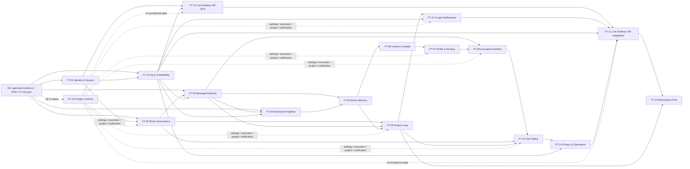

# 已批准 PRD 的实施映射与依赖总图

> 日期：2026-08-18
> 性质：只读代码审计与实施规划；不是 Blueprint、任务状态或验收记录。
> 产品权威：[已批准 PRD](../reconstruction/2026-08-agent群聊协作模式-prd.reconstructed.md)；证据权威：[evidence map](../reconstruction/agent-im-evidence-map.md)；UI/交互权威：[FT-16 设计基线](../design/README.md)。

## 结论与使用边界

PRD 的 **103** 条规范性 Requirement 均为当前 owner 批准的 A 类。本文件将其映射到 FT-01～FT-16，并把现有实现仅作为可复用机制或 Gap 证据；历史任务、静态 renderer、fixture、review 页面和交付说明均**不是**新 PRD 的生产能力证明。

本规划遵循以下边界：

- 新路线是 M1～M6；旧 T-0026 / 旧 M4 路线已被取代。M1 是已批准输入基线，不产生新的生产 FT。
- MVP 不带回旧五分区跨 Room inbox、Mobile/Web、OS push、global search、full Blueprint/GBP、BYOK 或多 Provider。
- FT-16 是所有 UI 任务的设计合同：实现者必须同时满足具体 `REQ-*`、设计稿 J-01～J-07、权威状态来源（local/ACK/event/projection）、错误恢复及可访问性要求；设计稿和 prototype-only 点击绝不能替代服务端证据。
- 当前 Git 基线为 `codex/t0026-expand-m4` / `bbf3d087f593cea8e193311a8ca51a1160db67a0`。开始时已存在 `CONTEXT.md` 修改，以及 `docs/design/`、`docs/reconstruction/` 和两份 FT-01 计划文件的未跟踪改动；它们属于其他工作，未被改写或纳入本规划。

## 103 条 Requirement 的逐项 FT 映射

下表从 PRD 的 `后续任务` 字段逐项转录。每个清单的数字是该 FT 直接负责或共同负责的 Requirement 数；跨 FT 的 ID 有意重复。汇总脚本按 PRD 的 103 个唯一 ID 比对：无缺失、无新增 ID。

| FT | 数量 | Requirement ID |
| --- | ---: | --- |
| FT-01 Identity & Session | 17 | REQ-AGT-004、REQ-AGT-012、REQ-ID-001、REQ-ID-002、REQ-ID-003、REQ-ID-004、REQ-ID-005、REQ-NFR-006、REQ-NFR-008、REQ-NFR-011、REQ-NFR-014、REQ-PRIM-001、REQ-PRIM-002、REQ-PRIM-004、REQ-ROOM-004、REQ-UX-005、REQ-UX-006 |
| FT-02 Room Governance | 9 | REQ-ID-003、REQ-NFR-014、REQ-PRIM-003、REQ-PRIM-005、REQ-ROOM-001、REQ-ROOM-002、REQ-ROOM-003、REQ-ROOM-004、REQ-UX-005 |
| FT-03 Message Authority | 15 | REQ-ID-001、REQ-MSG-001、REQ-MSG-002、REQ-MSG-003、REQ-MSG-004、REQ-MSG-005、REQ-MSG-006、REQ-MSG-007、REQ-MSG-008、REQ-PRIM-006、REQ-PRIM-007、REQ-PRIM-008、REQ-PRIM-010、REQ-PRJ-004、REQ-UX-007 |
| FT-04 Attachment Pipeline | 2 | REQ-MSG-009、REQ-PRIM-009 |
| FT-05 Room Memory | 11 | REQ-MEM-001、REQ-MEM-002、REQ-MEM-005、REQ-MEM-006、REQ-MEM-007、REQ-MEM-010、REQ-MSG-005、REQ-MSG-006、REQ-MSG-010、REQ-PRIM-008、REQ-PRIM-014 |
| FT-06 Context Compiler | 9 | REQ-MEM-003、REQ-MEM-004、REQ-MEM-007、REQ-MEM-008、REQ-MEM-009、REQ-MEM-011、REQ-MEM-012、REQ-PRIM-014、REQ-PRJ-013 |
| FT-07 Agent Profile & Routing | 14 | REQ-AGT-001、REQ-AGT-002、REQ-AGT-003、REQ-AGT-004、REQ-AGT-005、REQ-AGT-007、REQ-ID-004、REQ-MEM-011、REQ-NFR-006、REQ-PD-004、REQ-PRIM-004、REQ-PRIM-011、REQ-PRIM-013、REQ-UX-005 |
| FT-08 Invocation Runtime | 16 | REQ-AGT-001、REQ-AGT-002、REQ-AGT-004、REQ-AGT-006、REQ-AGT-008、REQ-AGT-009、REQ-AGT-010、REQ-AGT-012、REQ-MEM-008、REQ-MEM-010、REQ-MSG-001、REQ-MSG-008、REQ-NFR-005、REQ-PRIM-011、REQ-PRIM-012、REQ-PRIM-013 |
| FT-09 Project Loop | 24 | REQ-AGT-005、REQ-AGT-006、REQ-MEM-005、REQ-PRIM-003、REQ-PRIM-010、REQ-PRIM-015、REQ-PRIM-016、REQ-PRIM-017、REQ-PRJ-001、REQ-PRJ-002、REQ-PRJ-003、REQ-PRJ-004、REQ-PRJ-005、REQ-PRJ-006、REQ-PRJ-007、REQ-PRJ-008、REQ-PRJ-009、REQ-PRJ-010、REQ-PRJ-011、REQ-PRJ-012、REQ-PRJ-013、REQ-ROOM-001、REQ-ROOM-003、REQ-UX-004 |
| FT-10 Tool Safety | 11 | REQ-AGT-009、REQ-AGT-010、REQ-AGT-011、REQ-AGT-012、REQ-AGT-013、REQ-MEM-004、REQ-NFR-011、REQ-NFR-014、REQ-PRIM-018、REQ-PRJ-013、REQ-ROOM-004 |
| FT-11 Live Desktop | 11 | REQ-NFR-007、REQ-NFR-010、REQ-NFR-013、REQ-PD-001、REQ-UX-001、REQ-UX-002、REQ-UX-003、REQ-UX-004、REQ-UX-005、REQ-UX-006、REQ-UX-007 |
| FT-12 In-app Notifications | 5 | REQ-PRIM-017、REQ-PRJ-010、REQ-PRJ-012、REQ-UX-003、REQ-UX-008 |
| FT-13 Sync & Reliability | 21 | REQ-AGT-001、REQ-ID-005、REQ-MEM-001、REQ-MSG-001、REQ-MSG-002、REQ-NFR-001、REQ-NFR-002、REQ-NFR-003、REQ-NFR-004、REQ-NFR-005、REQ-NFR-007、REQ-NFR-008、REQ-NFR-010、REQ-NFR-011、REQ-NFR-014、REQ-PRIM-002、REQ-PRIM-006、REQ-PRJ-004、REQ-PRJ-012、REQ-ROOM-004、REQ-UX-006 |
| FT-14 Privacy & Operations | 17 | REQ-AGT-004、REQ-AGT-009、REQ-AGT-013、REQ-ID-004、REQ-ID-005、REQ-MEM-010、REQ-MEM-012、REQ-MSG-006、REQ-MSG-010、REQ-NFR-001、REQ-NFR-003、REQ-NFR-005、REQ-NFR-006、REQ-NFR-008、REQ-NFR-009、REQ-NFR-012、REQ-NFR-013 |
| FT-15 Real-project Pilot | 6 | REQ-PD-001、REQ-PD-002、REQ-PD-003、REQ-PD-004、REQ-PD-005、REQ-UX-001 |
| FT-16 Design Contract | 15 direct | REQ-AGT-003、REQ-AGT-008、REQ-AGT-012、REQ-ID-003、REQ-MEM-006、REQ-MSG-004、REQ-MSG-010、REQ-NFR-010、REQ-PRIM-001、REQ-PRIM-007、REQ-PRIM-012、REQ-UX-002、REQ-UX-004、REQ-UX-007、REQ-UX-009 |

FT-16 的设计覆盖矩阵还对 **全部 103 条** Requirement 给出了一个设计主映射；上表的 15 条是 PRD 指定由 FT-16 直接承担的 Requirement，并不缩小该横切设计职责。

## FT 实施档案

`硬依赖`表示前置权威合同、数据模型或安全闸门尚不存在时不能交付；`软依赖`表示可以先定义接口、测试 seam 或只读 UI，但端到端验收须等对方收敛。路径均为当前已存在的区域；“新模块”仅表示可在该现有目录内增建，未伪造不存在的文件名。

| FT / 里程碑 | 可复用的历史代码、测试与合同 | 新 PRD Gap 与预计修改区域 | 依赖与并行策略 | 建议自动化验收层级 |
| --- | --- | --- | --- | --- |
| **FT-01** M2；M5 的租约/安全收口 | T-0039 的 Human-only auth、session refresh/revoke、邀请与 Agent 配置分轨；T-0040 的 SQLite/identity outbox；当前 FT-01 implementation plan 已定义 device-family 切片。`packages/server/src/auth.ts`、`persistence/authority-worker.ts`、`websocket.test.ts` 是基础。 | 当前没有邀请绑定的 account provisioning/披露完成链、Tenant Administrator、Global Profile 管理、Room cache 清除或 offline lease；device family slice 正由另一会话处理，不能并行占用其共享文件。区域：`packages/server/src/auth.ts`、`protocol.ts`、`websocket.ts`、`persistence/{schema.ts,authority-database-handler.ts,contracts.ts,worker-protocol.ts}`；`packages/desktop/src/{main.ts,preload.ts,window.ts,renderer/}`。 | 硬：FT-02、03、07、11、13、14 都依赖它的认证 principal/撤权。软：FT-16 可先定义 J-01。当前 slice 完成前，其他任务不得改 schema v12/session 族或 preload/auth 线路。 | 单元+schema migration+AuthorityWorker transaction；真实 WebSocket 两设备 E2E；Electron main/preload/renderer 集成；撤权与缓存失效安全回归。 |
| **FT-02** M2 | T-0039 的 RoomLifecycle、invite/configuration 分离和审计；T-0040 的 server authority。 | 现行唯一 owner、admin peer 约束、ownership transfer、自离群责任清理、archive 后成员只读/reopen、冻结业务 timer/confirmation grant 语义都不满足新合同。区域：`packages/core/src/index.ts`、`packages/server/src/room-lifecycle.ts`、`persistence/{schema.ts,authority-database-handler.ts,snapshot-worker.ts}`、`protocol.ts`、`websocket.ts`、`renderer/app.ts`。 | 硬：FT-01 认证；FT-03 房间范围消息；FT-09 的责任清理；FT-10/13 的 archive 安全收敛。可与 FT-03 的纯消息合同并行；同一 migration、AuthorityWorker、protocol 批次必须串行。 | Core state-machine/type tests；SQLite migration/transaction/invariant；权限矩阵 API/WS；reopen/restart/repair E2E；FT-16 drawer/错误态 DOM。 |
| **FT-03** M2 | T-0040 durable `message.accepted`、event/outbox/idempotency、history/realtime；T-0013/0014 只可复用人/Agent 分治机制；T-0041 final/preview 分离。 | Message 仍是纯文本；生产协议没有 structured mention/reply/revision/tombstone/correction，也没有同事务逐 target Request/invocation intent。regex/raw agent ID、兼容 primitives 与静态 UI均不能证明能力。区域：`packages/core/src/{index.ts,sync.ts}`、`packages/server/src/{protocol.ts,websocket.ts,service.ts,primitives.ts}`、`persistence/{schema.ts,authority-database-handler.ts,snapshot-worker.ts}`、`packages/desktop/src/{sync/client-sync-replica.ts,renderer/}`。 | 硬：FT-01 principal、FT-02 active/archived access、FT-13 atomic event/repair。软：FT-04 attachment link、FT-05 tombstone exclusion、FT-08 invocation handoff、FT-09 Request。可先锁闭合 message model/protocol，随后串行接入 attachment、runtime和项目派生。 | Core guards/type test；wire negative/ACK-idempotency；worker transaction crash tests；multi-client repair E2E；renderer only after ACK/event tests。 |
| **FT-04** M2 | T-0040 durable source/event/repair机制；T-0041 的受限 adapter、安全最小披露和 secret sentinel测试。 | 无 upload/object metadata/hash、preview/download authorization、text extraction/OCR 或 attachment source retrieval；不能把本地 blob/fixture 当作实现。区域：`packages/server/src/persistence/`、`packages/server/src/{protocol.ts,websocket.ts,authoritative-server.ts}`、`packages/core/src/{index.ts,sync.ts}`、`packages/desktop/src/{preload.ts,renderer/,sync/}`。 | 硬：FT-03 message/source transaction、FT-13 durable storage/repair、FT-01 membership download recheck。软：FT-05 corpus和 FT-06 retrieval。上传写入先于 extraction，可让 extractor 并行但必须以 durable attachment ID 收敛。 | hash/MIME/size guard；storage+schema transaction；authorization/download test；extract/OCR fixture with failure transparency；restart/cross-device E2E；safe preview Electron test。 |
| **FT-05** M3 | T-0040 corpus persistence/repair；T-0041 runtime recovery；T-0017～0019 的来源/责任投影可作为迁移经验。 | 无 steward、五类 memory、watermark、source index、Context dispute/resolution 或 recall operational exclusion；当前最近 64 条窗口不符合 corpus 合同。区域：`packages/core/src/{collaboration.ts,sync.ts}`、`packages/server/src/persistence/{schema.ts,authority-database-handler.ts,snapshot-worker.ts}`、`packages/server/src/{authoritative-server.ts,agent-runtime/}`。 | 硬：FT-03 revision/tombstone、FT-04 attachment source、FT-13 durable rebuild；FT-02 Room boundary。软：FT-09 confirmed project facts。可先在 authority 建立 versioned memory/source model，与 FT-06 编译器并行；watermark contract 必须共同评审且串行合入。 | closed record/state-transition tests；steward async/idempotency/restart tests；dispute exclusion tests；repair equivalence；memory-failure degraded E2E。 |
| **FT-06** M3 | T-0041 provider `store:false`、runtime/room-memory tool seam；T-0016 bounded router input仅可借鉴有界性。 | 当前 adapter 将历史全映为 `user`、丢 speaker kind/time/relations，且只取最近 64 条；无 manifest、frozen snapshot、token-budget degradation、source/attachment retrieval 或 no-retention audit。区域：`packages/server/src/agent-runtime/{openai-responses-provider.ts,agent-runtime-service.ts,worker-runtime-authority.ts,tool-gateway.ts}`、`persistence/{authority-database-handler.ts,schema.ts}`、`packages/core/src/collaboration.ts`。 | 硬：FT-05 memory/watermark；FT-04 attachments；FT-01/02 current membership recheck。软：FT-07 persona envelope、FT-10 read tool。可独立完成 deterministic compiler/tests，但不要在 FT-05 未定义 snapshot/version 前接生产 invoke。 | pure compiler golden/property tests；provider request/secret sentinel；snapshot retry/crash equivalence; source membership-revocation tests；bounded-size/failure E2E。 |
| **FT-07** M3 | T-0039 membership capability-subset；T-0041 runtime/provider configuration；T-0016 route job/closed candidate机制。 | 当前 Actor/Profile 为启动 static seed；无 Tenant Administrator command/audit、Global Profile CRUD、per-Room Assignment producer、ready/busy/paused/noauth派生门禁；仍有 silent，on-mention 被点名时无工具，Router 看到全局而非 Room grant。区域：`packages/core/src/{index.ts,collaboration.ts}`、`packages/server/src/{authoritative-server.ts,route-runtime/,agent-runtime/}`、`persistence/{schema.ts,authority-database-handler.ts,authority-worker.ts}`、`protocol.ts`、`renderer/`。 | 硬：FT-01 administrator/auth、FT-02 owner/admin assignment、FT-06 envelope/readiness context。硬于 FT-08 selection；软于 FT-11 settings display。Profile persistence和 routing policy可平行设计，但共用 actor/schema/protocol 的提交须串行。 | core closed profile/assignment guards；authority ACL/audit tests；routing decision matrix；restart readiness derivation; WS rejection and FT-16 settings UI tests。 |
| **FT-08** M3 | T-0041 durable execution/attempt/CAS/retry/confirmation/outcome_unknown；T-0016 route job；T-0020 的 cancellation/CAS仅作并发实现材料。 | 现行 public invoke可伪报 routed kind、message→intent 的 durable handoff未闭合、route terminal→invoke存在丢失窗口；preemption 是 room-wide而非 scoped；retry/recovery/confirmation/archive/revoke语义与新合同不同，timeout可能留 running。区域：`packages/server/src/{authoritative-server.ts,human-preemption/,agent-runtime/,route-runtime/}`、`persistence/{schema.ts,authority-database-handler.ts,authority-worker.ts,snapshot-worker.ts}`、`protocol.ts`、`websocket.ts`、`renderer/`。 | 硬：FT-03 structured mention + same-transaction intents、FT-06 frozen context、FT-07 availability；FT-10 side-effect gate。可先做 execution state/invocation persistence，后串行连接 tool confirm、recall/archive/revoke race。 | lifecycle/CAS race and deterministic clock tests；fault/restart/retry E2E；multi-target independence; cancel/recall/archive/revoke matrix；renderer five-state ACK/event test。 |
| **FT-09** M4 | T-0017 OpenItem、T-0018 LightTask、T-0019 Ball 的 schema/outbox/repair/holder projection可复用；但其旧产品语义不继承。 | 无 Goal/Decision；OpenItem/LightTask state machine不是 Request/NextAction/Blocker；缺 confirmation principal、supersede、Agent owner/verifier、transfer/defer/cannot_answer区别、per-source Ball and 24h due contract。区域：`packages/core/src/{collaboration.ts,sync.ts}`、`packages/server/src/{primitives.ts,protocol.ts,websocket.ts,ball-runtime/}`、`persistence/{schema.ts,authority-database-handler.ts,snapshot-worker.ts}`、`renderer/`。 | 硬：FT-02 Room/leave cleanup、FT-03 @Human transaction、FT-05 confirmed/disputed memory、FT-13 repair。FT-12 due delivery hard-depends on stable boundaries; FT-07/08 proactive use is soft until object model finalized. Domain state model must be serial; panel UI can follow events in parallel. | core state machine/property tests；authority principal matrix and idempotency; Ball recomputation/time/restart tests；sync/repair E2E；FT-16 proposal/confirmed/disputed DOM tests。 |
| **FT-10** M3 | T-0041 closed read tools, exact confirmation/grant/claim and outcome_unknown form the mechanism base. | Need align to new global∩assignment∩current membership permissions, room-memory/project reads, current §8 principal and handoff, archive/recall/scoped cancel/revoke races, grant lifecycle and mandatory review; no generic shell/deploy/message capability may leak back.区域：`packages/server/src/agent-runtime/{tool-gateway.ts,worker-runtime-authority.ts,agent-runtime-service.ts,tools/}`、`persistence/{schema.ts,authority-database-handler.ts}`、`protocol.ts`、`renderer/`。 | 硬：FT-01 sessions, FT-02 archive, FT-06 room-memory read, FT-07 grants, FT-08 executions; FT-09 supplies project commands. Tool adapter hardening can parallelise, but authority claim protocol must serialize with FT-08 schema. | adapter call-count-zero rejection matrix；confirmation/grant races; outcome_unknown/review test; server-side reauthorization E2E; security canary; FT-16 confirmation accessibility test。 |
| **FT-11** M2 live slice；M5 integration/packaging | Existing Electron security window policy, static renderer components/tests and `ClientSyncReplica`; FT-01 plan provides a constrained auth bridge. | Default Desktop is blank static page, empty preload, no auth/WS/cache/IPC/room controller; callbacks are synchronous fake success. Need room-first three columns, catalog/timeline/project atomic selection, all authoritative async state, offline/revoked/fatal surfaces.区域：`packages/desktop/src/{main.ts,preload.ts,window.ts,renderer/,sync/}`、with server `protocol.ts`/`websocket.ts` integration. | 硬：FT-01 identity bridge; FT-02/03 commands; FT-13 replica/cache; FT-16 design. M2 may deliver minimal true Room flow after those foundations; M5 adds full repair, accessibility, package/ops acceptance. Static component refactor can run in parallel, but wiring to protocol/replica is serialized. | Electron main/preload contract; DOM/keyboard tests; real Electron→WS→SQLite happy and failure journeys; cache/revoke/repair E2E; macOS packaging smoke. |
| **FT-12** M4；M5 integrated desktop | T-0019 room-scoped ReminderCandidate/boundary claim only; it is not a notification delivery implementation. | No recipient-scoped durable notification facts, read/handled projection, flat center/badge/deep link/multi-session sync or archive/revoke suppression. No OS push.区域：`packages/core/src/{collaboration.ts,sync.ts}`、`packages/server/src/{protocol.ts,websocket.ts}`、`persistence/{schema.ts,authority-database-handler.ts,snapshot-worker.ts}`、`packages/desktop/src/{sync/,renderer/}`。 | 硬：FT-09 source/boundary model; FT-13 events/repair; FT-01 recipient/session. Soft: FT-11 UI shell. Notification data contract can be built once FT-09 boundaries exist; visual center may parallel after contract. | idempotent `(recipient, source boundary, type)` tests; read vs handled transitions; archive/revoke suppression; multi-session repair E2E; deep-link/accessible renderer tests. |
| **FT-13** M2 foundation；M5 reliability close | T-0040 SQLite, migration, event/outbox/idempotency, cursor/repair and replica E2E; existing `ClientSyncReplica`. | Need expand repair to every approved visible record; 30-day idempotency expiry/cleanup; outbox backoff/max/dead-letter/alert; encrypted cache, offline read-only, server-signed finite lease, revocation purge and archive safety. Existing snapshot lacks new facts and outbox hot-retries.区域：`packages/server/src/{outbox-dispatcher.ts,fallback-repair-coordinator.ts,authoritative-server.ts,persistence/}`、`packages/core/src/sync.ts`、`packages/desktop/src/sync/`、`packages/desktop/src/{main.ts,preload.ts}`。 | Hard foundation for FT-03/04 persistence, FT-08 intents, FT-09/12 projection, FT-11 cache, FT-14 security. Parallelize feature-owned record definitions, but one owner batches schema/snapshot/protocol migrations and one owner owns cache cryptography/lease integration. | migration/replay TTL; transaction crash; retry/backoff/dead-letter; 3-client cursor/repair; encrypted cache fault tests; revoke/lease expiry/archived E2E. |
| **FT-14** M5 | T-0041 server-only secret provider, `store:false`, sentinel tests and closed adapters; T-0040 single-tenant SQLite baseline. | Need Tenant Administrator bootstrap/audit and credential rotation, provider disclosure, no-retention proof for every adapter, diagnostics/export separation, retention ops, bounded worker policy/alerts, explicit lease threat model/default/upper bound, and safe attachment/cache/IPC handling.区域：`packages/server/src/{authoritative-server.ts,agent-runtime/,persistence/,index.ts}`、`packages/desktop/src/{main.ts,preload.ts,window.ts,renderer/}`。 | Hard: FT-01 admin/session, FT-10 tool outcomes, FT-13 lease/cache/outbox; soft: FT-04 attachments, FT-06 provider context. Starts as cross-cutting review tests early; final operational values only freeze after dependent mechanisms exist. | secret/corpus canary scans; configuration/ACL/audit tests; provider no-retention contract tests; diagnostics-vs-export tests; worker queue/recovery capacity tests; threat-model config tests. |
| **FT-15** M6 | No historical task proves this requirement. Existing test fixtures, live-smoke skips and old fixed-team criteria are expressly insufficient. | Need real 2–3 Human project pilot, event collection defined in PRD §13, qualitative review and reprioritization without artificial numerical gate. Area: operational use of the live Desktop/server plus a pilot evidence record; no Blueprint status mutation. | Hard: delivered M2–M5 core journey, especially FT-11/13/14. Soft: none that substitutes real use. It is necessarily serial after MVP; analysis of pilot events can parallel with support triage. | production-like macOS journey smoke before pilot; scoped telemetry/query integrity tests; reproducible anonymized metric extraction; owner review of qualitative findings—not fixture or synthetic acceptance. |
| **FT-16** M2–M5 cross-cutting design contract | Owner-delivered design baseline, J-01～J-07 and 103-row design coverage matrix. Current static review pages are only visual evidence. | Must turn each user-facing FT contract into implementable states: authority source, loading/empty/offline/revoked/degraded/fatal, error recovery, source links, keyboard/focus/non-colour/reduced-motion and actual minimum Desktop window. Regions: `docs/design/` is input only; production implementation occurs in existing `packages/desktop/src/{renderer/,main.ts,preload.ts,window.ts}` tests. | No server hard dependency to publish a design-spec slice, but **hard acceptance gate** for any UI FT: FT-01 J-01, FT-03/04 J-02, FT-07/08 J-03, FT-09 J-04/J-06, FT-10 J-05, FT-12/13 J-07, FT-02 settings/archive states, FT-11 shell. Can parallel with backend only when IDs and wire states are frozen. | visual/state contract review plus DOM/accessibility tests; real Electron journey tests prove ACK/event/projection rather than prototype-only effects. |

## 生产实施依赖 DAG

M2 的并行泳道是 FT-01、FT-02、FT-03、FT-04、FT-11（最小 live slice）和 FT-13；只有 schema/AuthorityWorker/protocol/cache 的共享提交需串行。M3 是 FT-05、FT-06、FT-07、FT-08、FT-10：先冻结 memory/context/profile 合同，再让 runtime/tool 接线。M4 是 FT-09→FT-12。M5 是 FT-11（集成）、FT-13（可靠性收口）、FT-14；M6 只能在真实 MVP 上运行 FT-15。

## 文件所有权与冲突规避

| 共享面 | 真实当前路径 | 首要 FT owner | 会冲突的 FT | 规则 |
| --- | --- | --- | --- | --- |
| schema / migrations | `packages/server/src/persistence/schema.ts`、`schema.test.ts`、`legacy-importer.ts` | FT-13（迁移协调） | FT-01～10、12、14 | 每个 feature 先提出 closed record/upgrade test；一次只由一个集成批次追加 schema version/checksum/fingerprint。不得修改历史 migration。当前 FT-01 v12 计划期间尤其禁止并发触碰。 |
| AuthorityWorker / transaction handler | `packages/server/src/persistence/{authority-worker.ts,authority-database-handler.ts,worker-protocol.ts,worker-database-client.ts,contracts.ts}` | FT-13（boundary）+对象 FT | FT-01、02、03、05、07～10、12、14 | 一个 command 的 domain/event/outbox/idempotency 必须同一 transaction；按 command family 分切，合并前执行 transaction/race suites。 |
| authoritative server | `packages/server/src/authoritative-server.ts` | FT-13（lifecycle） | FT-04、05、07、08、10、14 | 只在 feature contracts/worker seam稳定后接线；维护 shutdown ordering、无 fixture production branch、无跨 feature callback 伪 ACK。 |
| WebSocket / closed protocol | `packages/server/src/{protocol.ts,websocket.ts,protocol.test.ts,websocket.test.ts}` | FT-03（message）与 FT-13（recovery） | FT-01、02、04、07～10、12 | 每次增加 requestId-correlated closed frame 与相应 error/ACK/event；不暴露 actor/capability/grant/secret，也不让 UI callback 当成功。 |
| sync / repair / outbox | `packages/core/src/sync.ts`、`packages/server/src/{outbox-dispatcher.ts,sync-service.ts,fallback-repair-coordinator.ts,persistence/snapshot-worker.ts}` | FT-13 | FT-01～12、14 | 新权威可见对象必须同时定义 event、repair record、watermark、dedupe 与 revocation behavior；outbox retry policy由 FT-13 单点实现。 |
| Desktop preload / IPC | `packages/desktop/src/{preload.ts,main.ts,window.ts}` | FT-01（identity）然后 FT-11（product transport） | FT-04、10、13、14 | `window.dao` 只扩展固定的、验证过的 domain API；不提供 generic send/channel/token/fs/shell。FT-01 active slice 拥有 auth IPC 文件。 |
| renderer / app | `packages/desktop/src/renderer/{main.ts,app.ts,styles.css,index.html,app.test.ts}` | FT-11（shell/connection） | FT-01、02～04、07～10、12、16 | 以 roomId 原子状态和 server ACK/event/projection 驱动；每个 feature 修改自己的组件分区和 tests，FT-16 对交互状态和 accessibility 进行 gate review。 |
| Desktop replica / encrypted cache | `packages/desktop/src/sync/{client-sync-replica.ts,client-sync-replica.test.ts}` | FT-13 | FT-11、01、02～12、14 | 保持 cache 非事实源；任何 record/lease/revoke变动与 repair staging、atomic commit和在线清除共同提交。 |
| composition roots | `packages/server/src/authoritative-server.ts`、`packages/desktop/src/main.ts` | FT-13/FT-11 | FT-01、04、07、08、10、14 | 最后接线、最少 owner、真实依赖；不能为了测试在 production root 加 fake/mock 或违反单 writer。 |

## 历史任务的继承、覆盖与仅机制复用

| 历史任务 | 仍有效的合同 / 可复用机制 | 被新 PRD 覆盖或不足之处 | 本规划处理 |
| --- | --- | --- | --- |
| T-0039 Identity & Room lifecycle | server-derived Human author；Human invitation 与 Agent configuration 分轨；服务端 membership/revoke；auth/session基础。 | JSON/JSONL persistence 已由 T-0040替代；旧 archive/member规则不满足唯一 owner、transfer、archived read-only/security concurrency；没有 Tenant Administrator、offline lease和新披露。 | 复用 FT-01/02 的 auth/lifecycle结构和测试风格；新产品语义以 REQ-ID/ROOM/NFR 为准。 |
| T-0040 Authority persistence/sync | SQLite authority、single writer、event/outbox/idempotency、cursor/repair、at-least-once/eventId dedupe、migration discipline。 | v5/九类事实范围不是新 PRD repair 完整性；现有 snapshot/outbox/backoff/cache仍有 Gap，不能以旧 E2E宣称新 UI/record已恢复。 | 作为 FT-03/04/05/08/09/12/13的底座；每个新事实补全 transaction+repair+E2E。 |
| T-0041 Agent runtime | real provider、server-only secret、`store:false`、closed adapters、attempt/CAS、confirmation/grant、outcome_unknown、sentinel机制。 | 当前 64-message/context identity、global readiness、tool grants、retry/recovery、confirmation/archive/recall/preemption和模型产品语义不符合 REQ-MEM/AGT；当前 tool set不定义新项目合同。 | FT-06/08/10/14复用机制，重新实现新 context/authority gates；不得把「有真实 Provider」说成「新 PRD Agent已交付」。 |
| T-0016 Route runtime | one RouteJob、closed candidates、per-Agent judgment、bounded queue和Route runtime tests。 | `silent`被否决；raw ID/direct client-supplied routed invoke、static topic/profile、route handoff gaps及旧抑制产品语义都被新 PRD改写。 | FT-07/08只复用 durable route/CAS/bounded orchestration；新的 structured mention、availability、proactive和execution contracts重新定义。 |
| T-0017 OpenItem | explicit authority object、source/owner/transfer lineage、Agent proposal server-side seam、sync/repair机制。 | 新 PRD用 Request、NextAction、Blocker/OpenQuestion；状态、principal、acceptance、answer/defer/cannot_answer/transfer和Ball语义不等价。 | FT-09可迁移经验或数据，不可直接把 OpenItem 状态当新对象语义。 |
| T-0018 LightTask | explicit Human command、state-machine/criteria、verifier audit、outbox/repair和无 Blueprint 写入边界。 | NextAction允许 Human/Agent owner及新 accept/deliver/done/reopen/reassign合同；旧角色验证规则和human-only不是新 PRD验收。 | FT-09重建新 NextAction，不把 LightTask改名或直接宣称满足。 |
| T-0019 BallInCourt | 每 source 单 holder、boundary claim、room-scoped projection、Human不被代言、重启去重机制。 | 旧 source为OpenItem/LightTask/Blueprint；新 PRD source为 Request/NextAction/Blocker/confirmation/due；旧 Blueprint adapter明确延期，旧 reminder不是 durable notification；目前 unique RouteJob consumption有Gap。 | FT-09/12/13继承 projection/claim模式，重新绑定新 source；不接 full Blueprint或旧 inbox。 |
| T-0020 Human preemption | commit-before-abort、terminal CAS、late result fence、recovery/lineage并发防线。 | 任意新 Human message的 room-wide fence 被 REQ-AGT-010替换为关联 reply/correction/cancel 的 scoped preemption；archive/confirmation/grant和已 dispatch outcome按新合同收敛。 | FT-08/10仅复用取消机制；不得保留旧全房间产品语义。 |

历史 T-0016～T-0020 与 T-0039～T-0041 的交付说明均是实现证据，不是新 PRD 的验收状态；本文件不将任何历史任务标为 verified。

## 已批准决定、工程设计值、延期与 owner 未知

| 类别 | 结论 |
| --- | --- |
| 已批准产品决定 | 103 条 Requirement、M1～M6、Desktop-first/macOS、单租户 SQLite、真实多人项目、Room=Project、Human/Agent分治、结构化 mention、五类 memory、active/on-mention、单 Provider/模型、逐次副作用确认、轻量项目闭环、in-app notification、archive/reopen、8项延期，均已由 PRD批准。 |
| 需工程设计冻结的实现值 | migration sequence、storage layout、MIME/文件大小/提取器边界、token budget/digest策略、queue/concurrency/timeout/backoff数值、retention/outbox alert阈值、cache encryption format、`maxOfflineReadLease`默认值与上限、Threat-model test matrix、支持的具体文件类型和容量测试方法。这些值必须以相应 FT spec/tests 冻结，不能由 renderer或历史默认值暗中决定。 |
| 明确延期 | DEF-001旧跨 Room inbox；DEF-002高级通知/OS push；DEF-003 Mobile/Web；DEF-004 global search；DEF-005 full Blueprint/GBP；DEF-006数值门槛；DEF-007 multi-provider/BYOK；DEF-008永久删除 UI。不得以「实现方便」把任一项带回 MVP。 |
| 真正需要 owner 决策的未知 | **本次没有。** PRD 已把当前产品必需的未知收敛为 A 类决定或已批准延期。上述工程值由工程设计、安全/容量验证确定；若其选择会改变批准的产品边界或延期，才应另行提交 owner。 |

## 可直接下达的 shaped 任务（不创建 Blueprint ID）

1. **FT-03：权威消息 vNext 合同。** 先为 structured mention/reply/revision/tombstone/Agent correction定义 core、schema、closed protocol、transaction event/outbox/repair record；依赖 FT-01 principal和 FT-02 archived rule，验收以 worker crash、多目标 partial rejection和repair E2E为主。
2. **FT-02：Room governance state machine。** 实现唯一 owner、transfer、leave/remove责任清单、archive/reopen及安全治理并发；不改当前 FT-01 session slice，验收以权限矩阵和archive/confirmation/revoke race为主。
3. **FT-04：attachment authority foundation。** 建立 attachment ID/metadata/hash/source-message和授权预览/下载，文本提取/OCR走异步且有失败状态；依赖 FT-03 durable message和 FT-13 repair，禁止 local-only blob success。
4. **FT-13：new-product repair/outbox slice。** 为 FT-02/03的新事件定义完整 snapshot/repair/dedupe和idempotency-expiry；加入 backoff/dead-letter而不影响 FT-01 schema work，验收为三客户端clear-cache与故障注入。
5. **FT-05/06：memory data model and deterministic compiler spec。** 分两提交：先五类 memory/source/watermark/dispute权威模型，再冻结 context manifest/snapshot/token degradation；依赖 FT-03/04，验收要求不使用64条窗口或全量prompt。
6. **FT-07：profile/assignment and routing boundary。** 建立 Tenant Administrator鉴权/audit、Global Profile/Room Assignment、active/on-mention与availability重验；随后连接 Router，明确移除 silent和client-supplied routed kind。
7. **FT-08/10：durable invocation and tool-race closure。** 把 message transaction的逐 target intent、scoped cancel、retry/review、confirmation/grant claim和archive/revoke/recall race收敛为一个权威状态图；依赖 FT-03/06/07，验收为CAS/timeout/restart/adapter call-count-zero。
8. **FT-09：Project Loop domain replacement。** 以 Goal/Decision/Request/NextAction/Blocker/Ball重建 Core/SQLite/repair，先不修改旧 Blueprint；依赖 FT-02/03/05，验收为全部合法/非法迁移和per-source Ball重算。
9. **FT-11/16：live Desktop shell after FT-01 bridge。** 将身份、catalog、Room atomic restore、timeline/composer/right panel接到 real IPC/WS/replica，逐屏落实 J-01～J-07及可访问性；禁止把现有 review route转成「已接线」证据。
10. **FT-12/14：notification and security-operability closeout。** 在FT-09 boundary后增加recipient-scoped durable center/badge，同时完成 lease threat model、diagnostics/export separation、provider disclosure和operational alert；依赖 FT-13、FT-01、FT-10。

## 完整性与交付检查

- PRD unique Requirement count：**103**；本文件逐项映射集合与 PRD集合相等，未新增 `REQ-*` ID。
- 设计输入：FT-16当前设计基线与 103-row coverage matrix已引用；不把设计HTML或 static fixture作为生产验收。
- 生产代码：本次未修改。唯一新增规划文件为本文。
- Blueprint：未读写或手改 HTML/JSON，未创建 task ID，未改变任务/里程碑状态。

实施映射已交付，等待 owner 使用或验收。
