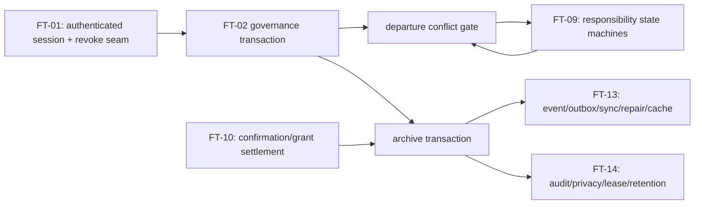

# FT-02 Room Governance · 文件级实施计划

> 日期：2026-08-18
> 状态：**TDD 实施计划；仅在 FT-01 合入后的独立实现会话执行**
> 工程设计：[2026-08-18-ft02-room-governance-design.md](./2026-08-18-ft02-room-governance-design.md)

## 1. 交付目标和执行约束

实现 Room 即 Project、唯一 owner、owner/admin/member 治理、离群责任清理、archive/reopen 及其 authority/sync/Desktop 闭环。实现必须满足 `REQ-ROOM-001`～`REQ-ROOM-004`、`REQ-PRIM-003`～`REQ-PRIM-005`、`REQ-ID-003`/`REQ-ID-005`、`REQ-NFR-002`～`REQ-NFR-004`、`REQ-NFR-007`～`REQ-NFR-008`、`REQ-NFR-011`～`REQ-NFR-014`，并为 `REQ-PRJ-004`～`REQ-PRJ-012` 与 `REQ-AGT-012` 留出已测试 seam。

这份计划不是对当前工作树的修改授权。当前会话不改 `packages/**`、schema、migration、WebSocket、Desktop 或生产代码。后续实施会话也必须：

- 在开始时重新记录 Git 基线，保留所有其他会话改动；不得 reset/checkout/clean/stash 覆盖；
- 先确认 FT-01 的实际提交、合并 migration 版本和 exported contracts；不能把本文审计时看到的未跟踪 FT-01 文档当 API；
- 不写 Blueprint HTML/JSON，不修改任务状态；
- 不实现 cross-Room inbox、Mobile/Web、OS push、global search、full Blueprint、永久删除、multi-tenant/组织模型、通用 shell 或未经 Human 确认的外部副作用。

## 2. 进入条件与集成决策点

在写第一行生产代码前，实施者须在同一工作树做以下只读核对；任一条件未满足时停在 seam 对齐，不能猜测。

| 检查 | 通过条件 | 否则行动 |
| --- | --- | --- |
| FT-01 集成 | `AuthenticatedSessionContext`、session revoke、身份 event/outbox、cache invalidation seam 的实际形状可用且有测试。 | 与 FT-01 所有者约定 adapter；FT-02 不直接修改其未合入 schema。 |
| migration 顺序 | `AUTHORITY_SCHEMA_VERSION`、上一个 checksum/fingerprint/schema contract 来自实际 merged HEAD。 | 在合并队列指定新的连续版本；绝不占用“v12”或重写历史 migration。 |
| FT-09 departure port | `DepartureResponsibilityPort` 能在 AuthorityWorker transaction 内列出 Request、NextAction、Blocker/OpenQuestion 和 acceptance 的活动引用，并能通过 own-command 完成/转交/升级。 | 只实现不依赖它的治理命令，所有 leave/remove fail closed `dependency_unavailable`；不把 OpenItem/LightTask 改名冒充 FT-09。 |
| FT-10 archive safety port | 同一 transaction 可标记未 dispatch confirmation `rejected(room_archived)`、撤销 grant、fence waiting execution，且 dispatch 先 recheck room lifecycle。 | archive command 不进入 production；不能只设置 `rooms.status`。 |
| FT-13/14 runtime/cache ports | lifecycle delta/repair、cache purge、offline lease/attachment read 的责任边界确定。 | 不宣称 archived read、撤权 cache 或租约行为已实现。 |

## 3. 目标落点与修改边界

本计划只列仓库中当前已存在的文件路径；新增类型、测试和 UI 都应先落到这些既有模块，避免把 feature 拆成未经审阅的新平行框架。

| 层 | 计划修改的现有文件 | 目的 |
| --- | --- | --- |
| Core | `packages/core/src/index.ts`, `packages/core/src/collaboration.ts`, `packages/core/src/sync.ts`, `packages/core/src/actor.type-test.ts`, `packages/core/src/collaboration.type-test.ts`, `packages/core/src/collaboration.test.ts`, `packages/core/src/sync.test.ts` | closed governance/conflict/timer projection types、guards、events/repair records 与 type tests。 |
| Command/persistence | `packages/server/src/persistence/contracts.ts`, `packages/server/src/persistence/contracts.test.ts`, `packages/server/src/persistence/worker-protocol.ts`, `packages/server/src/persistence/worker-database-client.ts`, `packages/server/src/persistence/worker-database-client.test.ts`, `packages/server/src/persistence/authority-worker.ts`, `packages/server/src/persistence/authority-database-handler.ts`, `packages/server/src/persistence/sqlite-authoritative-store.ts`, `packages/server/src/persistence/sqlite-authoritative-store.test.ts`, `packages/server/src/persistence/schema.ts`, `packages/server/src/persistence/schema.test.ts`, `packages/server/src/persistence/legacy-importer.ts`, `packages/server/src/persistence/legacy-importer.test.ts` | single-writer command/transaction/schema/invariant/migration/restart implementation。 |
| Lifecycle/auth/composition | `packages/server/src/room-lifecycle.ts`, `packages/server/src/room-lifecycle.test.ts`, `packages/server/src/auth.ts`, `packages/server/src/auth.test.ts`, `packages/server/src/authoritative-server.ts`, `packages/server/src/authority.e2e.test.ts` | lifecycle façade、FT-01 revoke seam、archive participant assembly、real-process evidence。 |
| Runtime/tool/route/ball | `packages/server/src/agent-runtime/worker-runtime-authority.ts`, `packages/server/src/agent-runtime/worker-runtime-authority.test.ts`, `packages/server/src/agent-runtime/agent-runtime-service.ts`, `packages/server/src/agent-runtime/agent-runtime-service.test.ts`, `packages/server/src/agent-runtime/tool-gateway.ts`, `packages/server/src/agent-runtime/tool-gateway.test.ts`, `packages/server/src/route-runtime/route-runtime-service.ts`, `packages/server/src/route-runtime/route-runtime-service.test.ts`, `packages/server/src/ball-runtime/ball-runtime-service.ts`, `packages/server/src/ball-runtime/ball-runtime-service.test.ts` | archived gates, dispatch truthfulness, frozen business work and post-reopen rescan。 |
| Sync/transport/outbox | `packages/server/src/sync-service.ts`, `packages/server/src/sync-service.test.ts`, `packages/server/src/persistence/snapshot-worker.ts`, `packages/server/src/persistence/snapshot-worker-client.ts`, `packages/server/src/persistence/snapshot-worker-client.test.ts`, `packages/server/src/outbox-dispatcher.ts`, `packages/server/src/outbox-dispatcher.test.ts`, `packages/server/src/protocol.ts`, `packages/server/src/protocol.test.ts`, `packages/server/src/websocket.ts`, `packages/server/src/websocket.test.ts` | closed governance frames/errors, repair/read authorization, dispatch and barrier semantics。 |
| Desktop | `packages/desktop/src/sync/client-sync-replica.ts`, `packages/desktop/src/sync/client-sync-replica.test.ts`, `packages/desktop/src/renderer/app.ts`, `packages/desktop/src/renderer/app.test.ts`, `packages/desktop/src/renderer/styles.css`, `packages/desktop/src/renderer/main.ts`, `packages/desktop/src/window.test.ts` | Room settings, conflict sheet, archived read-only/reopen states and accessible authority-driven UI。 |

## 4. TDD slices in dependency order

Each slice is: add the stated RED test → make the smallest contract/implementation pass → run the focused regression set → refactor only after evidence is green. A failing test must not be skipped, weakened, converted to a snapshot-only assertion, or papered over by UI hiding.

### Slice 0 — Reconcile contracts before schema work

**Read/confirm** `docs/plans/2026-08-18-ft01-identity-session-implementation-plan.md`, `packages/server/src/auth.ts`, `packages/server/src/persistence/schema.ts`, `packages/server/src/persistence/contracts.ts`, `packages/server/src/persistence/authority-database-handler.ts`, and all actual merged FT-01 diffs.

**Deliverable:** a written implementation-PR note (not a Blueprint change) naming the actual predecessor schema version, the FT-01 session reduction adapter, the FT-09 departure query/command adapter, and the FT-10 settlement adapter. If a port is absent, install a fail-closed composition seam and test it; do not continue into archive behavior.

**Focused tests:** existing schema/auth/contracts suites stay green before any FT-02 test is enabled.

### Slice 1 — Freeze Core governance and replica contracts

**RED:** add to `collaboration.test.ts`/`sync.test.ts` malformed-object tests for Room-project equality, lifecycle/revision, ownership event, archive/reopen event, frozen timer projection and departure conflict list. Add negative `@ts-expect-error` assignments in `actor.type-test.ts`/`collaboration.type-test.ts` proving Human/Agent role separation and closed conflict variants.

**GREEN:** add the §4 types/guards from the design to `index.ts`, `collaboration.ts`, `sync.ts`; extend `PersistedRoomEvent` and `RoomRepairRecord` with explicit discriminants. Reject unknown/extra fields in parser paths.

**Regression assertion:** an `eventId` can be replayed exactly once; an archived governance record cannot be parsed as an active mutation ACK; a cross-room conflict/record fails before cache application.

### Slice 2 — Migration first: canonical one-owner representation

**RED in `schema.test.ts`:**

1. fresh DB migrates to the actual next version and has only the declared new columns/tables/triggers/indexes;
2. every supported historical schema, including the FT-01 merged predecessor, preserves actors, sessions, rooms, membership, messages, audit and existing runtime facts while gaining canonical owner state;
3. a room with zero owner, two owners, an Agent owner, foreign-room owner membership or duplicate current membership fails validation;
4. injected failure at every meaningful statement rolls schema/data/user_version/migration history back as one transaction;
5. future schema, unknown tables/columns, historical checksum/fingerprint tampering and invalid migration history refuse before mutation.

**GREEN:** append exactly one immutable migration in `schema.ts`, update only the new schema contract/fingerprint/checksum, add deferred FK/triggers and the `room_business_timer_freezes` storage described in the design. Update legacy import only where it must create canonical ownership without inventing responsibility/provenance.

**Do not:** modify a v1–predecessor statement/checksum, assign a hard-coded version ahead of FT-01, or delete/rename historical data without a verified transform.

### Slice 3 — Governance command engine and role matrix

**RED in `room-lifecycle.test.ts`, `contracts.test.ts`, `sqlite-authoritative-store.test.ts`:**

- owner transfer only targets a current Human member; single transfer changes ownership exactly once and restarts with the same result;
- owner controls admin; admin controls member/ordinary Agent only; admin acting on owner/admin peer is 403; member governance is 403;
- `expectedGovernanceRevision` detects stale role/transfer/remove/archive commands as 409 without mutation;
- owner leave/remove before transfer is `ownership_transfer_required`; after transfer, old owner can leave subject to responsibility gate;
- same idempotency input replays original ACK, changed payload conflicts, and fresh idempotent lifecycle retries do not create duplicate audit/event/outbox.

**GREEN:** extend `contracts.ts`, `worker-protocol.ts`, `worker-database-client.ts`, `authority-worker.ts`, `authority-database-handler.ts`, `sqlite-authoritative-store.ts` and `room-lifecycle.ts`. The façade must pass server-derived `AuthenticatedCommandContext`; no public method accepts a caller-supplied actor/role. Each success is one authority transaction containing domain change, immutable audit, stable event, outbox and idempotency record.

**Focused regressions:** role matrix at handler *and* WebSocket parser level; concurrent exact-key and distinct-key calls; worker close/reopen between successful command and receipt retry.

### Slice 4 — Departure conflict port and final recheck

**RED:** with a transaction-local fake/real owning-port fixture, assert one conflict each for active Request, NextAction, Blocker/OpenQuestion, pending confirmation and pending acceptance; an empty list permits removal. Assert conflict IDs are stable, Room-scoped, actionable and omit secrets. Assert a responsibility created after preflight but before final remove makes final remove return 409 with the new closed list.

**GREEN:** make `room.member.leave` and `room.member.remove` call the FT-09/FT-10 participants from the same AuthorityWorker transaction. The final command never changes a responsibility itself; it only observes its legal terminal/transfer/escalation/rejection state. Map unavailable dependency to 503 and test it.

**Required policy tests:**

- owner/admin cannot silently accept a target Human's Request/NextAction/Blocker responsibility;
- a pending confirmation can only be rejected/revoked by the FT-10 path, not misreported complete;
- transfer/explicit escalation retains immutable source/audit history;
- member self-leave cannot bypass the gate; remove cannot erase author history.

### Slice 5 — Archive transaction and safety settlement

**RED across `sqlite-authoritative-store.test.ts`, `worker-runtime-authority.test.ts`, `tool-gateway.test.ts`, `agent-runtime-service.test.ts`:**

1. archive records one archive generation/time and returns the same result for exact replay/concurrent duplicate; fresh repeat yields `already_archived` and no duplicate audit/event/outbox;
2. archive atomically freezes all registered business timers at one transaction clock, rejects pending confirmation as `room_archived`, revokes unconsumed grant and fences waiting work;
3. archive rolls back every part if any participant fails—no partial status/freeze/rejection/outbox;
4. pending side-effect claim after archive invokes no adapter; an already-dispatched side effect remains dispatched/outcome-unknown, never “revoked”;
5. active business commands and runtime/route/steward resume fail 409 before enqueue/fact/event/outbox;
6. session revoke/member or Agent removal/capability-grant reduction still commits in archived state, writes audit as applicable and triggers zero business wake-ups.

**GREEN:** implement participant ordering in `authority-database-handler.ts` and register seams in `authoritative-server.ts`. Make `agent-runtime`, `tool-gateway`, route runtime and ball runtime lifecycle-check before claim/resume/dispatch/scan. Do not use an in-memory timer pause flag as durable state.

### Slice 6 — Reopen and timer continuity

**RED:** create due/review/boundary timers with known clock values, archive half-way, restart worker/server, advance wall clock beyond original due, then reopen. Assert they fire only after the saved remaining duration; no duplicate claim/notification/invocation occurs. Assert confirmation/session/grant absolute expiry passes while archived and expired confirmation cannot revive after reopen.

**GREEN:** reopen in one transaction restores due/review boundary from frozen remaining duration, clears the matching freeze records, writes one audit/event/outbox, then schedules a bounded after-commit rescan. Repeat/restart reopen remains idempotent. Add the narrowly defined archived owner transfer exception only when it is required for secure owner departure and never starts business work.

### Slice 7 — Closed WebSocket protocol and authorized read/sync

**RED in `protocol.test.ts`/`websocket.test.ts`:** strict new governance frames/ACKs/events/error detail reject missing/extra/wrong/oversized fields; requests cannot supply actor/role/session/grant. Test 401, 403, 404, 409 and 503 mappings. Test current archived Human membership can read history/facts/audit, while removed/nonmember/Tenant Administrator-without-membership cannot.

**GREEN:** add closed parse/unparse variants in `protocol.ts`, map errors in `websocket.ts`, and connect lifecycle façade methods only after a current session recheck. Reuse request IDs and return no success based merely on UI/local callback.

**RED in `sync-service.test.ts`, `snapshot-worker-client.test.ts`, `client-sync-replica.test.ts`:** archived delta/repair produces the same Room state; archive/remove preempts an in-flight streaming repair without fixed-view leakage; removed member staging is discarded; event replays apply once; authorized archive read-only repair commits atomically.

**GREEN:** extend snapshot/repair serialization and lifecycle access rules while retaining the existing cursor/barrier/`eventId` protocol.

### Slice 8 — Outbox, crash and process restart proof

**RED:** use existing deep-only crash seams to check archive/reopen/transfer/remove at all durable boundaries:

- before commit: all governance fact/audit/event/outbox/idempotency/freeze/settlement rows absent;
- after commit before outbox: facts/audit/events/settlement exist, no ACK is invented, retry gets original result and recovery delivers stable event ID;
- after send before dispatch mark: delivery may repeat but desktop replica applies one event;
- restart during archived state: business workers remain asleep and safety expiry keeps flowing;
- restart after reopen: only resumed, still-valid timers are scanned.

**GREEN:** use existing `OutboxDispatcher` and authority child harness; do not add a second delivery channel or a test-only production bypass.

### Slice 9 — Desktop governance/read-only/recovery UI

**RED in `packages/desktop/src/renderer/app.test.ts`:**

- member/admin/owner see text and controls matching the permission matrix; peer-admin controls never claim permission;
- ownership transfer restricts target to current Human members and retains selection/input on 409;
- departure sheet groups all five conflict classes, links only same-Room source IDs, provides only server-supplied legal actions and replaces a stale list on final 409;
- archived Room has a persistent textual read-only indicator; history/attachment/fact/audit navigation remains available; business composer/project/Agent controls are disabled with explanation;
- archive/reopen controls remain submitting until matching `requestId` ACK and stable event/projection; repeated event and reconnect do not duplicate banner/audit result;
- focus, labels, `aria-live`, non-colour semantics and error recovery meet `REQ-UX-005`～`REQ-UX-009`.

**GREEN:** consume `ClientSyncReplica` governance projection in `app.ts`, add narrowly scoped styles in `styles.css`, and preserve the existing static visual/join review routes. `renderer/main.ts` must not manufacture authority state; no new renderer access to Node, credentials, shell or raw WebSocket authority capability.

## 5. Cross-feature integration sequence

- FT-01 supplies authenticated Human/session reduction primitives, but FT-02 owns no FT-01 schema version or credentials UI. Its one hard rule is that session revoke remains callable irrespective of Room lifecycle.
- FT-09 owns all responsibility transitions. FT-02 owns the governance precondition and conflict list only; it must not make old OpenItem/LightTask behavior appear compliant with Request/NextAction/Blocker requirements.
- FT-10 owns confirmation/grant/dispatch semantics. FT-02 owns the archive lifecycle transaction that requests settlement; it must never call an external adapter, undo a dispatch, or claim an unknown outcome is revoked.
- FT-13 owns delivery, offline cache and repair durability; FT-02 contributes state/event/authorization behavior to the shared stream.
- FT-14 owns finite offline lease configuration, privacy/export/diagnostics and retention. FT-02 supplies archive audit/read-only lifecycle but no permanent-delete path.

## 6. Required verification order

Run focused tests after each slice, then run this final order from the actual integrated working tree. Exact command spelling may follow the package manager version committed at that time; no test is considered passed merely because a historical delivery note says it once passed.

1. Core typecheck plus `actor.type-test.ts`, `collaboration.type-test.ts`, `collaboration.test.ts`, `sync.test.ts`.
2. Schema/legacy/contract/worker/store focused tests, including fresh, all historical migrations, future refusal and injected rollback.
3. Room lifecycle/auth/runtime/tool/route/ball focused tests.
4. Protocol/WebSocket/sync/snapshot/outbox/Desktop replica focused tests.
5. Real `authority.e2e.test.ts` child-process multi-client/restart/crash coverage.
6. `pnpm typecheck`.
7. `pnpm lint`.
8. `pnpm verify:core-boundary`.
9. `pnpm test`.
10. `pnpm build`.
11. `git diff --check`.

The eventual delivery note must state exact commands/counts, migration predecessor and assigned version, evidence for the permission/CAS/idempotency/crash matrix, which FT-01/09/10/13/14 seams were integrated, and any remaining external limitation. It may say “FT-02 reached delivery evidence” only if true; it must not declare FT-02 verified, because owner verification is a separate action.
