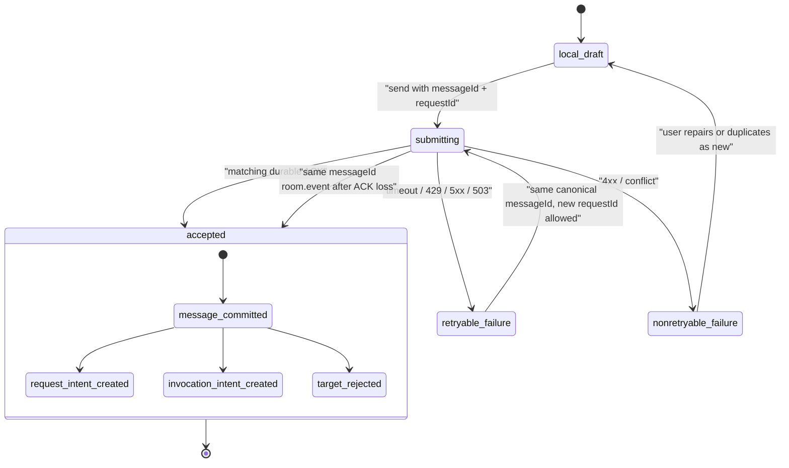
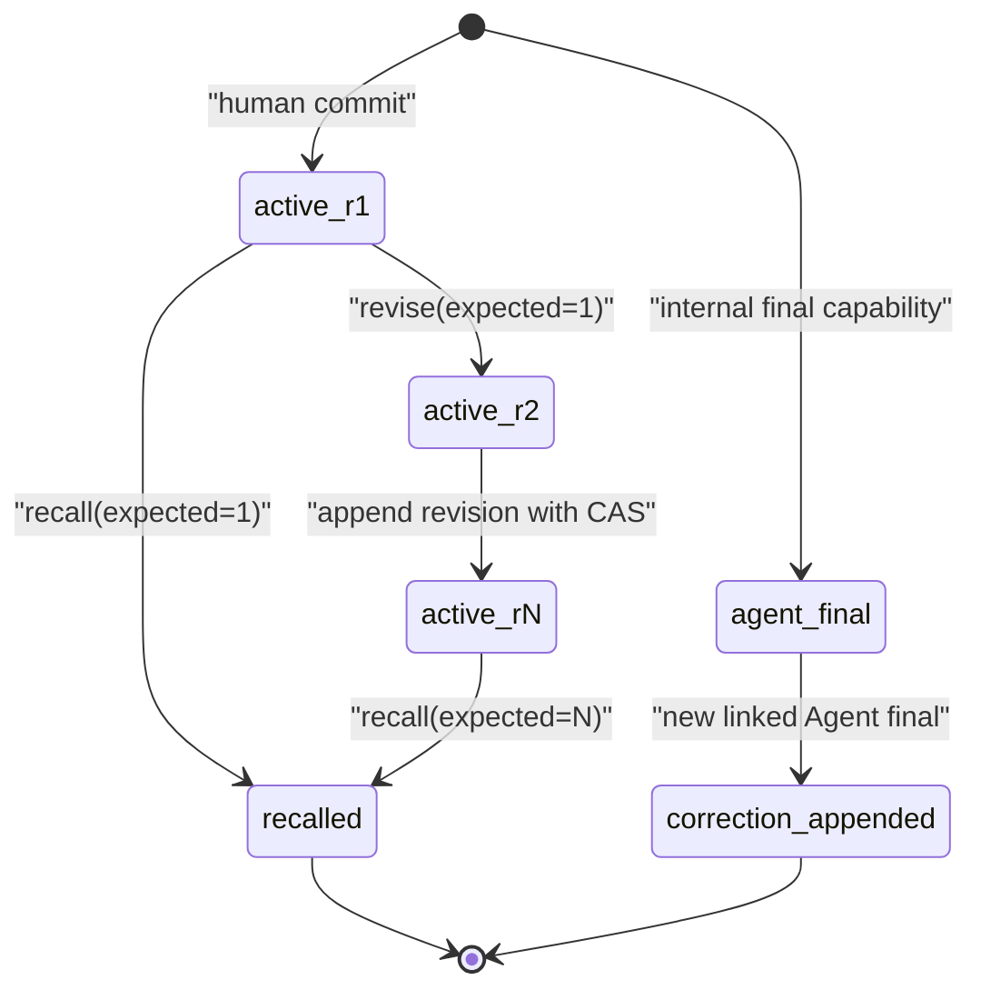

# FT-03 Message Authority：生产工程设计与协议状态机

> 日期：2026-08-18
> 状态：设计与实施输入；**不是实现、验收或 verified 声明**。
> 本文只定义 FT-03 的目标合同、迁移边界和测试证据。它不授权修改生产代码、schema、migration、WebSocket、sync、Desktop 或其他 FT 的未提交接口。

## 1. 目的、权威输入与范围

FT-03 把 Room 的消息从“可追加的一段文本”升级为可审计、可同步、可恢复的权威事实：服务端决定作者；正文之外的结构化 target 决定寻址；修改和撤回有明确不可变历史；消息提交、target intent/outcome、event、outbox 和幂等 receipt 同事务落盘。

本设计以以下已提交基线为准：

- 产品语义：[`2026-08-agent群聊协作模式-prd.reconstructed.md`](../reconstruction/2026-08-agent群聊协作模式-prd.reconstructed.md) 第 3、5、6、7、9、10 节；
- 证据与现状：[`agent-im-evidence-map.md`](../reconstruction/agent-im-evidence-map.md) 的 B-SURFACE-01/03/04/04a 及 GAP-007/008/009/013/021/024；
- Desktop 基线：[`docs/design/README.md`](../design/README.md) 与 `J-02`，以及 [`design-requirement-coverage.md`](../design/design-requirement-coverage.md)；
- 已有持久/同步语义：[`message-ack.md`](../protocols/message-ack.md)、[`identity-room-lifecycle.md`](../protocols/identity-room-lifecycle.md)、[`authoritative-sync.md`](../protocols/authoritative-sync.md)；
- 当前实现事实：`packages/core`、`packages/server`、`packages/desktop` 中的 message、persistence、sync、runtime 与测试。

### 1.1 Requirement 覆盖

| 覆盖层级 | Requirement |
| --- | --- |
| 直接主责 | `REQ-ID-001`、`REQ-PRIM-006`～`REQ-PRIM-012`、`REQ-MSG-001`～`REQ-MSG-008`、`REQ-UX-007` |
| 结构/安全联动 | `REQ-PRIM-001`、`REQ-PRIM-003`、`REQ-MEM-001`、`REQ-MEM-008`、`REQ-MEM-011`、`REQ-AGT-001`、`REQ-AGT-002`、`REQ-AGT-008`、`REQ-AGT-010`、`REQ-NFR-002`～`REQ-NFR-005`、`REQ-NFR-007`、`REQ-NFR-010`、`REQ-NFR-011`、`REQ-NFR-012`、`REQ-NFR-014` |
| 只留稳定关联 seam | `REQ-MSG-009`、`REQ-MSG-010`；文件上传、扫描、预览、下载、提取/OCR 与 attachment policy 属于 FT-04 |

明确不在 FT-03 范围：旧 Mobile、跨 Room inbox、search、OS push、full Blueprint、独立 Thread、模型上下文编译、Agent profile/routing 选择、执行调度/重试/工具确认，以及附件 pipeline。FT-03 也不把自然语言 `@`、displayName、正则或 UI CSS class 当作任何权威输入。

### 1.2 核心结论

1. **消息提交是 durable commit，不是工作完成。** `message.accepted` 只证明消息及每个结构化 target 的持久结果都已提交；不证明其他设备收到了消息、memory 更新、RouteJob 已结束、execution running，或 Agent final 已存在。
2. **作者不能从网络输入取得。** Human 作者只能从经认证 session principal 导出；Agent final 只能由服务端内部的、不可序列化 capability 注入。任何公共 command 中的 `authorId`、`authorKind` 都是闭合解析错误。
3. **target 必须有结果。** 每一个结构化 target 在同一提交内恰落为一个 `HumanRequestIntent`、`AgentInvocationIntent` 或一个持久 `rejected` outcome。某 target 已被移除/撤权，不回滚 Human 消息，也不影响其他 target。
4. **消息是 timeline 记录，不是 Thread 根。** `replyToMessageId` 只能引用同 Room 的稳定 `messageId`；被回复消息保留在主时间线。没有 threadId、child timeline 或独立 Thread transport。
5. **operational 与 audit 读取分开。** active Human message 的 revision chain 可由普通 Room history/sync/repair 重建；recalled message 只作为 tombstone 出现在 operational 读取中。原文、旧 revision 与附件关联只经受权 audit/export seam 取得，绝不经 memory、history、repair 或普通 retrieval 泄露。

## 2. 术语与权威边界

| 名称 | 权威含义 | 不是 |
| --- | --- | --- |
| `messageId` | 客户端在首次提交前生成的稳定 UUID；也是同一业务提交的幂等键与 timeline identity。 | 每次发送尝试的 requestId。 |
| `requestId` | 单一传输请求的关联 ID；重试可以使用新 requestId。 | durable 业务 identity 或 Agent completion receipt。 |
| `MessageEnvelope` | 已提交消息的稳定作者、结构性关联、生命周期和当前 revision 指针。 | UI local draft、preview 或 Provider partial。 |
| `MentionTarget` | 正文之外、带 stable actorId 的闭合 entity。range 只供渲染/定位，actorId 才是寻址权威。 | 从正文/regex/displayName 推导出的 `@文本`。 |
| `TargetOutcome` | 一个 target 的持久化接受或拒绝结果。 | target 已接受 Request、Agent 已执行或已答复。 |
| `HumanRequestIntent` | `@Human` 提交时建立的 pending source intent；后续 Request 接受/拒绝/转交的项目生命周期由其消费者扩展。 | 从普通文本自动推导的责任。 |
| `AgentInvocationIntent` | `@Agent` 提交时建立的可被 FT-08 claim 的 source intent。 | 客户端直接自报 `routed_candidate`/provider/capability 的执行命令。 |
| `MessageRevision` | Human active message 的 append-only 正文版本。 | 对 target/reply/attachment 的隐式重写。 |
| `MessageTombstone` | recalled 消息的 operational 视图；不携带原文/mention/reply/attachment。 | 物理删除或可被 memory 读取的“隐藏消息”。 |

## 3. Closed core 合同、guards 与 type tests

以下是目标形状，用于后续核心类型设计；字段名可在实现前做一次全仓命名对齐，但语义、closed union 和禁止字段不可放松。所有 guard 都须拒绝未知字段、空 ID、无效 ISO 时间、越界 range、重叠 range、跨 Room link 和不符合 discriminant 的字段。

```ts
type Utf16Range = Readonly<{ startUtf16: number; endUtf16: number }>;

type MentionTarget =
  | Readonly<{
      id: string;
      kind: "human-request";
      targetActorId: string;
      range: Utf16Range;
    }>
  | Readonly<{
      id: string;
      kind: "agent-invocation";
      targetActorId: string;
      range: Utf16Range;
    }>;

type AttachmentReference = Readonly<{ attachmentId: string }>;

type HumanMessageSubmit = Readonly<{
  messageId: string;
  roomId: string;
  body: string;
  mentionedTargets: readonly MentionTarget[];
  replyToMessageId?: string;
  attachments: readonly AttachmentReference[];
  authorId?: never;
  authorKind?: never;
  actorId?: never;
  capability?: never;
}>;

type MessageTargetOutcome =
  | Readonly<{
      targetId: string;
      targetActorId: string;
      kind: "human-request";
      status: "request-created";
      requestIntentId: string;
    }>
  | Readonly<{
      targetId: string;
      targetActorId: string;
      kind: "agent-invocation";
      status: "invocation-intent-created";
      invocationIntentId: string;
    }>
  | Readonly<{
      targetId: string;
      targetActorId: string;
      kind: MentionTarget["kind"];
      status: "rejected";
      code: "target_not_member" | "target_kind_mismatch" |
        "target_assignment_inactive" | "target_room_archived";
    }>;

type MessageLifecycle = "active" | "recalled";

type ActiveHumanMessage = Readonly<{
  id: string;
  roomId: string;
  authorId: string;
  authorKind: "human";
  createdAt: string;
  lifecycle: "active";
  currentRevision: MessageRevision;
  revisionCount: number;
  mentionedTargets: readonly MentionTarget[];
  replyToMessageId?: string;
  attachments: readonly AttachmentReference[];
  targetOutcomes: readonly MessageTargetOutcome[];
}>;

type AgentFinalMessage = Readonly<{
  id: string;
  roomId: string;
  authorId: string;
  authorKind: "agent";
  createdAt: string;
  lifecycle: "active";
  finalBody: string;
  sourceInvocationIntentId: string;
  sourceExecutionId: string;
  correctsMessageId?: string;
}>;

type MessageTombstone = Readonly<{
  id: string;
  roomId: string;
  authorId: string;
  authorKind: "human";
  createdAt: string;
  lifecycle: "recalled";
  recalledAt: string;
  revisionCount: number;
}>;

type TimelineMessage = ActiveHumanMessage | AgentFinalMessage | MessageTombstone;

type MessageRevision = Readonly<{
  messageId: string;
  revision: number;
  body: string;
  revisedAt: string;
  revisedByActorId: string;
}>;
```

### 3.1 结构性规则

- `mentionedTargets` 的 `id`、`(kind,targetActorId)` 和 range 均不得重复；ranges 使用 JavaScript UTF-16 index，满足 `0 <= start < end <= body.length`，且按 start 非重叠排序。该规则只验证编辑器产生的 entity 与正文位置一致，**不读取 range 内文本推断 actor**。
- target 对应 actor kind 必须在 acceptance transaction 内复核。Human target 要求当前 Human membership；Agent target 要求当前 Agent assignment 与允许的 participation。target membership/assignment 不成立时写 rejection，不能删除 entity 或拒绝整条 Human message。
- `replyToMessageId` 只能指向同 Room 已存在的 message，active 与 tombstone 都可以被稳定引用；跨 Room 与不存在的 target 以闭合错误拒绝。引用展示 tombstone 时不得泄露被撤回正文。
- attachment only stores stable `attachmentId` association. FT-03 不保存 filename、MIME、hash、URL、OCR 或字节流，也不实现上传。没有 FT-04 validator 时 public command 必须只接受空 attachments；不应降级为本地 file path 或 blob URL。
- Agent final/correction 从不带 `mentionedTargets`、reply 或附件创建能力；本期只允许带 final body、source invocation/execution、可选 `correctsMessageId` 的 server-internal commit。correction 必须同 Room、原目标为 Agent final、且同一 Agent author；它是新记录，原 final 永不更新/撤回。

### 3.2 编译期与运行期证明

`packages/core` 应导出 `isHumanMessageSubmit`、`isMentionTarget`、`isTimelineMessage`、`isMessageRevision`、`isMessageTargetOutcome` 和对应 sync/event guard；guard 使用 exact-key 检查。`MessageRevision` 和 tombstone audit view 是不同类型，不能把 audit row 赋给 operational timeline。

最少 type tests：

```ts
declare const publicDraft: HumanMessageSubmit;

// @ts-expect-error 网络 Human draft 不能选择作者
const forged: HumanMessageSubmit = { ...publicDraft, authorKind: "agent" };

// @ts-expect-error actorId 不是 public command 字段
const injectedActor: HumanMessageSubmit = { ...publicDraft, actorId: "agent-x" };

// @ts-expect-error Tombstone 没有可用于 memory 的 body
const leaked: string = ({} as MessageTombstone).body;

// @ts-expect-error Agent final 不是可修订 Human message
const editable: ActiveHumanMessage = {} as AgentFinalMessage;
```

Agent capability 采用 server-private `unique symbol`/module-private factory：网络 `ClientFrame`、core public command 和序列化 JSON 都没有该字段；内部 factory 只接受已由 FT-08 CAS claim 的 `(agentId, invocationIntentId, executionId)` receipt。除 type test 外，protocol parse test 必须证明即使通过 `as unknown` 注入上述字段也会被拒绝。

## 4. 命令、查询、事件、ACK 与错误 frame

所有 public frame 为 closed object，并回显 `requestId`。为避免破坏当前仅有 `{ id, roomId, body, sentAt }` 的 `message.send`，目标协议引入显式 v2 frame；迁移期间 v1 只可映射为无 target/reply/attachment 的 legacy message，不能偷偷解析正文。

| 类别 | frame / 内部命令 | 权威输入与结果 |
| --- | --- | --- |
| Human command | `message.send.v2 { requestId, message }` | `message` 是 `HumanMessageSubmit`；author 从 authenticated session 注入。 |
| Human command | `message.revise { requestId, roomId, messageId, expectedRevision, body }` | 仅 author 的 active Human message；只追加 body revision。 |
| Human command | `message.recall { requestId, roomId, messageId, expectedRevision }` | 仅 author 的 active Human message；产生 tombstone、取消 pending intents 并写 scoped fences。 |
| Server-internal command | `agent.message.final.commit` / `agent.message.correction.commit` | 仅内部 capability，可由 FT-08 final CAS 后调用；无 WebSocket counterpart。 |
| Query | `room.history.v2`、`message.revisions.query` | 权限复核后返回 canonical active timeline / revision chain；recalled raw content 不在这两个 operational query。 |
| Existing recovery query | `room.sync`、`room.repair.*`、`room.subscribe.v2` | 继续使用 RoomCursor/eventId；扩展 closed event 和 repair record unions。 |
| durable ACK | `message.accepted`、`message.revision.accepted`、`message.recall.accepted` | 只证明各自 AuthorityWorker transaction committed；不包含 completion/received/memory flags。 |
| asynchronous event | `room.event` with `room.message.accepted` / `room.message.revised` / `room.message.recalled` | 消息状态 delta 由 outbox at-least-once 分发，以 eventId 去重。 |

### 4.1 `message.send.v2` 与 ACK

```ts
type MessageSendV2Frame = Readonly<{
  type: "message.send.v2";
  requestId: string;
  message: HumanMessageSubmit;
}>;

type MessageAcceptedFrame = Readonly<{
  type: "message.accepted";
  requestId: string;
  messageId: string;
  persistedAt: string;
  targetOutcomes: readonly MessageTargetOutcome[];
}>;
```

`targetOutcomes.status === "invocation-intent-created"` 是“调用意图已耐久登记”；不是 execution accepted/running/completed。`request-created` 是“Request intent 已登记”；不是目标 Human 已接手。ACK 中禁止出现 `deliveredTo`、`memoryUpdated`、`executionId`（除非 FT-08 在独立的后续 event 产生真实 execution）或任何完成暗示。

同一 `messageId` 的 ACK 丢失重试可使用新 `requestId`，但必须字节等价地复用同一个业务 command。服务端以 `(author principal, "message.send.v2", roomId, messageId)` 的幂等 scope 和 canonical command hash 回放原始 durable acknowledgement，并把**本次** requestId 回显。相同键、不同 body/entity/link 返回 `409 idempotency_conflict`，不能创建第二条消息或第二组 target outcome。

### 4.2 error 合同与 Desktop 分类

| status / code | 何时 | Desktop J-02 处置 |
| --- | --- | --- |
| `400 invalid_request` / `invalid_message` / `mention_entity_invalid` / `author_fields_forbidden` | closed frame、正文/range/entity 不合法，或出现任何 author/capability 注入字段 | nonretryable；保留草稿，聚焦可修复字段。 |
| `401 unauthenticated` / `identity_forbidden` | 无有效 session 或伪造作者 | nonretryable；保留草稿，回到登录/会话恢复。 |
| `403 room_forbidden` | session 有效但已不是当前 Room member | nonretryable；保留草稿但不显示 Room 权威内容。 |
| `404 reply_target_not_found` | 回复目标不存在；不可用 target 不走该错误，而写逐 target rejection | nonretryable；保留草稿并清晰定位 reply 控件。 |
| `409 message_version_conflict` / `message_recalled` / `agent_final_immutable` / `idempotency_conflict` | revision/recall CAS、不可变 Agent final 或相同 key 改 payload | nonretryable；保留输入并提供 refresh/duplicate-as-new 明确动作。 |
| `410 protocol_upgrade_required` | 旧 client 不能安全表现 revision/tombstone 时 | nonretryable；强制升级，不回退泄露 raw message。 |
| `429` / `500` / `503 storage_unavailable` / `repair_barrier_active` | 可恢复容量、存储、网络或 scoped repair barrier | retryable；保留**原 messageId 和完整结构化草稿**。 |

`target_not_member`、`target_kind_mismatch`、`target_assignment_inactive` 和 `target_room_archived` 是 `message.accepted.targetOutcomes` 的持久逐 target rejection，不是全 command error；只有 author 自己无权、Room 已归档或整个 message shape 无效才拒绝完整 message。

## 5. 协议状态机

### 5.1 Human send / target state



每个 target 从 compose 到 outcome 的闭合状态为：`declared -> request-intent-created | invocation-intent-created | rejected`。一个 target 终态不能改变其他 target；target 后续 execution 或 Request lifecycle 属于独立 state machine，使用 target outcome 的 stable intent ID 关联。

### 5.2 消息生命周期与 revision/recall CAS



- `revise` 只更新 `current_revision` pointer，插入不可变 `MessageRevision`。它不能增加/删除/移动 mention，变更 reply、attachment 或 target 的动作没有该 command。
- `recall` 必须比较 `lifecycle=active AND current_revision=expectedRevision`。成功后不允许任何新的 revision、pending target dispatch 或 final commit 穿过该 source fence。
- Agent final/correction 没有 revise/recall transition。correction 只 append new record，不能更改 `correctsMessageId` 的内容或生命周期。

### 5.3 recall 与执行的 scoped fence

| 被关联对象在 recall commit 时 | 同一 transaction 的动作 | commit 后的外部动作 |
| --- | --- | --- |
| `HumanRequestIntent = pending` | 原子改为 `cancelled(message_recalled)`，保留 intent/audit。 | 后续 FT-09 consumer 不得 claim。 |
| `AgentInvocationIntent = pending/accepted` 且尚未 claim | 原子改为 `cancelled(message_recalled)`。 | 恢复扫描不再 enqueue。 |
| 已创建但尚未运行的 execution | 写 source-scoped fence；FT-08 claim CAS 读取 fence 后终结为 cancelled，不能启动。 | 仅发布真实 cancelled event。 |
| running model/read-only execution | 写 `(messageId, invocationIntentId, executionId)` cancel fence，不把完成伪改为失败。 | FT-08 先 durable cancel/CAS，再 AbortSignal；迟到 final 被 fence/CAS 拒绝。 |
| dispatched side effect / `outcome_unknown` | 记录 fence 已观察但不回滚。 | 沿用 FT-08/10 的 outcome/compensation 合同。 |
| completed final 或 confirmed project fact | 不更新、不撤回、不删除。 | 允许 UI 显示 source 已 recalled；事实仍保留 source revision/reference。 |

这不是旧 T-0020 的“任意新 Human message 取消同 Room 全部 Agent work”。FT-03 只产生 source-message scoped fence；在 FT-08 把现有 broad preemption 与本合同收敛前，不能启用 recall command。

## 6. AuthorityWorker transaction、持久化模型与 CAS

### 6.1 `message.send.v2` 单事务

`AuthorityWorker` 是唯一 writer。以下步骤在一次 `BEGIN IMMEDIATE … COMMIT` 内完成；任一步失败整笔 rollback，不能留下 message 无 target、target 无 event、event 无 outbox 或 ACK 已发的中间状态。

1. 解析 closed frame；验证 non-empty Human body、messageId、UTF-16 ranges、unique target、reply/attachment ID 形状，拒绝所有 author/capability 字段。
2. 从 authenticated session 取得 Human principal；同 transaction 重验 token/session、当前 Human membership、Room active。此处由服务端赋 `authorId` 与 `authorKind: "human"`。
3. 查询同 Room reply target；如果不存在则全 command 失败。调用 FT-04 attachment validator seam；未安装时 non-empty attachment 拒绝。
4. 对每个 target，在本 transaction 的当前 Room membership/assignment snapshot 中判定：合法 Human 写一个 `HumanRequestIntent`；合法 Agent 写一个 `AgentInvocationIntent`；失效 target 写一个 immutable rejected outcome。没有“先 commit message，再异步发现 target 丢失”的窗口。
5. 插入 `messages` base row、initial revision、固定结构性 links、target outcomes/intents。所有 link 都以 `messageId` 和 `roomId` FK/trigger 约束。
6. append 一个稳定 `room.message.accepted` event（payload 为 canonical operational timeline entry + outcomes），并写 room outbox delivery；写 idempotency record，receipt 包含同一 outcome set。
7. COMMIT 后才允许 dispatcher fan-out。FT-05/FT-08 各自从 durable intent/event 恢复，不是 ACK 前的 best-effort callback。

`message.revise` 和 `message.recall` 分别执行同一原子骨架，带 `expectedRevision` CAS；它们各写一个 room event、一个 room outbox delivery 和一个可重放 idempotency receipt。Agent final/correction transaction 另由 internal capability/FT-08 execution CAS 驱动，但仍在同一 writer 内写 message、event、outbox 和 idempotency（或 execution transition receipt）。

### 6.2 建议追加表（逻辑表，不预占 migration 版本）

当前 schema v11 是共享基线。实施时只能追加“当时下一个” immutable migration；**不要在本文预占 `v12` 或依赖另一会话尚未提交的 schema version/fingerprint**。

| 逻辑表 | 必要字段/唯一性 | 目的 |
| --- | --- | --- |
| `message_envelopes` | `message_id PK`、`room_id`、`message_kind`、`lifecycle`、`current_revision`、`recalled_at/by`、`created_at` | 把旧 `messages` base row 升级为 lifecycle-aware envelope。 |
| `message_revisions` | `(message_id, revision) PK`、body、author/revised time；Agent final 不写此表的可变 revision | append-only Human revision audit。 |
| `message_mentions` | `(message_id, target_id) PK`、kind、target_actor_id、range；`UNIQUE(message_id, kind, target_actor_id)` | 结构化 address source；禁止同消息同语义 target 重复派发。 |
| `message_reply_links` | `message_id PK`、`room_id`、`reply_to_message_id`；同 Room trigger | 稳定主线引用，不建 Thread。 |
| `message_attachment_links` | `(message_id, attachment_id) PK`、`operational_state` | FT-04 attachment stable association seam。 |
| `message_target_outcomes` | `(message_id, target_id) PK`、target fields、`created/rejected` discriminant、reason 或 intent ID | 每 target 有且仅有一个 durable outcome。 |
| `human_request_intents` | `id PK`、message/target/room、`pending|cancelled`、source revision | `@Human` 的初始 Request source。 |
| `agent_invocation_intents` | `id PK`、message/target/room、`accepted|claimed|cancelled`、source revision | FT-08 以 CAS claim 的 invocation source。 |
| `message_recall_fences` | unique message/intent/execution scope、created_at、reason | 阻断 pending/running 的 source-scoped continuation。 |
| `agent_message_corrections` | correction message ID unique、corrects message ID、same-agent constraint | 强制 append-only correction 关系。 |

`messages` 仍持有 stable message identity、Room、author 和 initial/current raw storage，以降低 legacy import 风险；所有 operational query 必须以 `message_envelopes` 的 lifecycle 为准。任何读路径直接 `SELECT messages.body` 都不满足 recall 安全边界。

### 6.3 必须由 database 强制的 invariant

1. `messages.author_kind` 永远等于 `actors.kind`；Human message author 由 authenticated Human context 写入，Agent final author 由 internal capability 的 agent 与 execution source 写入。
2. `message_envelopes.room_id` 与所有 revision/mention/reply/attachment/intent/fence 的 Room 一致；reply 目标同 Room。
3. active Human 恰有 `current_revision >= 1`，且对应 revision 存在；revision 数单调递增、不可 update/delete。Agent final 没有 revision mutation surface。
4. recalled envelope 不暴露 body、mention、reply 或 attachment links 给 operational history/sync/repair/retrieval；其 audit rows 仍保留且不能被物理删除。
5. 每个 persisted mention 恰有一个 target outcome；`created` outcome 必须指向同 Room、同 target 的对应 intent；`rejected` 不得带 intent ID。
6. invocation/request intent 只能引用 active Human source 的 frozen `sourceRevision`；recall 后任何 pending intent 必须 cancelled，不能重新 claimed。
7. correction 和 source Agent final 同 Room、同 Agent，且 correction 是另一 immutable message；不允许 self-overwrite。
8. 每一个成功 command transaction 同时存在 domain change、room event、room outbox 和 idempotency record；事务失败时四者均不存在。

### 6.4 CAS 与并发决定

| 操作 | compare-and-set 条件 | 冲突结果 |
| --- | --- | --- |
| Human revision | `author=self AND lifecycle=active AND current_revision=expected` | `409 message_version_conflict`；不写 revision/event。 |
| Human recall | 同上，且 recall row/fence 尚未存在 | `409 message_version_conflict` 或 idempotent replay；不物理删除。 |
| target intent claim | `status=accepted AND no recall fence AND current membership/assignment valid` | 已取消为 terminal cancelled；其他 race 为 intent conflict。 |
| Agent final commit | execution current attempt/claim matches、source intent claimed、无 recall fence | stale/late final 被拒，不生成 Agent message。 |
| target membership revoke vs submit | serial AuthorityWorker order决定；若 revoke 先提交则该 target writes rejected，否则 writes intent，随后治理/FT-08 recheck 负责撤权。 | 从不让该 race 回滚已合法 Human message。 |
| same messageId retry | same idempotency scope + canonical hash | 回放原 receipt；hash 不同为 `idempotency_conflict`。 |

## 7. history、realtime、sync、repair、outbox 与 preview

### 7.1 一个 source、四种读法

| 消费面 | 来源 | 去重 / merge |
| --- | --- | --- |
| `room.history.v2` | AuthorityWorker canonical operational projection | messageId 一条 timeline identity；revision 不改变时间线位置。 |
| realtime | committed event → transactional outbox → `room.event` | eventId at-least-once 去重，按 streamSeq 应用。 |
| delta sync | 同一个 `events` Room stream | eventId + cursor；不能把 ACK 当 cursor 或 delivery receipt。 |
| repair | 同一 message/envelope/revision/intent projection的 fixed-watermark snapshot | staging 中按 messageId/revision/eventId 重建；完成前不替换 live cache。 |

repair record 新增 closed `message-envelope`、`message-revision`、`message-target-outcome`、`human-request-intent`、`agent-invocation-intent` 与 `message-tombstone` discriminator，或等价的一个严格 `timeline-message` envelope；实现只能选一种 canonical representation，history/realtime/sync/repair 必须共享同一 projection factory。active message 的 revision records 重建版本链。recalled message 的 operational repair 仅输出 tombstone，绝不携带 raw revision/attachments；受权 audit/export 是单独的 FT-14 seam，不是 repair fallback。

outbox 只在 commit 后 fan-out，允许 `after-send-before-dispatch-mark` 重放；客户端以 `eventId` 消重。ACK 丢失时，replay receipt 或 event/delta/repair 中的同一 `messageId` 都能使发端收敛为 accepted。outbox 未投递、memory worker 未跑、runtime queue 满或其他设备离线都不能回写/否定已经 durable 的 `message.accepted`。

### 7.2 preview 与 stream chunk 的硬隔离

FT-08 可以向一个已订阅的本地展示通道发送 bounded `agent.preview`/stream chunk，但该数据：

- 没有 `messageId`、`eventId`、cursor 或 repair record；
- 不写 `messages`、revision、events、outbox、history、sync、repair、memory candidate 或项目提取；
- 取消、断线、attempt replacement、服务重启时直接丢弃；
- 不能作为 Agent final 的 optimistic placeholder，也不使用 typing 作为权威 execution 状态。

唯一进入历史的 Agent 文字是通过 internal final capability、execution CAS 成功的 `AgentFinalMessage`。这使 partial/preview 永远不能在 crash 后被当作事实、记忆或 confirmed project source。

## 8. Desktop J-02 状态映射

Desktop 的实现不属于本设计交付，但 J-02 必须遵守以下有限状态。每一状态的 source 不同，UI 不得把本地成功动画当成服务端事实。

| Composer 状态 | 权威来源 | 显示与输入保留 |
| --- | --- | --- |
| `idle` | local draft | 可编辑 body、mention chips、reply link、attachment refs。 |
| `submitting` | local pending request `(messageId, activeRequestId, canonical payload)` | 发送控件防重复；时间线可有“正在提交”本地 marker，但不是 canonical message/Agent status。 |
| `accepted` | matching `message.accepted` ACK，或同 messageId committed event after ACK loss | 以 messageId 合并到 canonical timeline；显示“已保存”；每个 target 显示 intent registered/rejected，绝不显示 Agent completed。清除 pending draft。 |
| `retryable-failure` | timeout、断线、429/5xx/503 frame | 保留完整 payload 和原 messageId；Retry 复用 canonical payload，可换 requestId；显示具体恢复动作。 |
| `nonretryable-failure` | closed 4xx/conflict frame | 保留完整 payload，定位错误；不自动重发，提供修改、刷新或复制为新 messageId。 |

实时 `room.event` 可先于 ACK 或与 repair 并发到达。renderer/store 先按 eventId 去重，再按 messageId 合并；只有 event 的 messageId 与 local pending 相同，才可将这次 local submission 收敛为 `accepted-via-event`。revision event 以 revision number CAS 更新本地 timeline，recall event 将正文替换为 tombstone 并清除 local operational cache 中的 body/mentions/reply/attachments。Agent execution card 只读取 FT-08 durable execution event；preview 使用单独、`aria-live="off"` 的 transient surface。

## 9. 权限与失败矩阵

| 场景 | 服务端决定 | durable 结果 |
| --- | --- | --- |
| 未认证 Human send | 无 principal，拒绝完整 command | 无 message/event/outbox/receipt。 |
| payload 注入 `authorId`/`authorKind` | parser/guard 拒绝，不能覆盖 | `401 identity_forbidden` 或 closed `invalid_request`；无写。 |
| 已认证非成员 send | 当前 membership recheck 失败 | `403 room_forbidden`；无写。 |
| Human 自己发送 + 两个合法 target | principal 注入 Human author | 一条 message、两个 created outcome、事件/outbox/receipt 同事务。 |
| 多 target 中一个刚被移除 | target-level current membership check 失败 | message 与其他合法 outcomes 提交；该 target 有 immutable `rejected(target_not_member)`。 |
| Human target ID 指向 Agent / Agent target 指向 Human | actor kind snapshot 不匹配 | message 提交；该 target `rejected(target_kind_mismatch)`。 |
| reply 指向另一 Room | same Room link check 失败 | 整个 submit `404 reply_target_not_found`；无写，不泄露跨 Room内容。 |
| author revise 自己 active message | revision CAS 成功 | append revision + event/outbox/receipt；target/reply/attachment/frozen source 不变。 |
| 非 author 或 Agent revise/recall | identity/lifecycle rule | `403` 或 `409 agent_final_immutable`；无写。 |
| recall 与运行 execution 竞争 | recall commit 先写 intent cancellation/fence | 无 pending continuation；late final CAS 拒绝；已完成 final/facts保留。 |
| Agent final | only internal capability + execution source CAS | Agent author server-injected，final immutable。 |
| Agent correction | internal capability，原 final same Room/same Agent | 新 immutable linked message；原 final 不变。 |
| preview / provider partial | never a persistence command | 可显示可丢弃数据；0 message/event/outbox/repair/memory row。 |

## 10. 与其他 FT 的明确前置条件

本文不调用或假定以下其他会话的未提交 API。实施开始时必须重新比较已经提交的合同；若名字/形状不同，以语义适配器替代，不把对方工作树接口编译进 FT-03。

| 依赖 | FT-03 所需已提交前置 | FT-03 输出给它的稳定 seam |
| --- | --- | --- |
| FT-01 Identity & Session | 认证 Human session principal、session/family revoke 和可在 AuthorityWorker transaction 内复核的 context；Agent 没有 public login。 | public Human command 永不含 author；所有 read/write 复用 current principal。 |
| FT-02 Room Governance | active/archived Room、Human membership/role、Agent assignment/remove 的 transactional lookup，及 access-reducing mutation recheck。 | target outcome 使用 Room 当前 membership/assignment；archive/revoke 不改变 audit，但阻止新写/claim。 |
| FT-04 Attachment Pipeline | 同 writer/transaction 可调用的 attachment-reference validator 和 operational visibility query；attachment ID 生命周期。 | `message_attachment_links` 的稳定 ID association 与 recall `operational_state=excluded` seam；不拥有 blob/pipeline。 |
| FT-05 Room Memory | 只消费 operational message projection；能记录 source message/revision and react to recall/revision event。 | active current content + tombstone contract；recall 后绝不返回 raw/attachment；revision 不改 frozen invocation snapshot。 |
| FT-08 Invocation Runtime | internal Agent-final capability、intent claim CAS、execution source/final CAS、cancel fence consumption、restart scan。 | atomic `AgentInvocationIntent` + target outcome，source revision，message recall fence；ACK 不等待 execution。 |
| FT-13 Sync & Reliability | stable room event/outbox, cursor/repair staging, authorization recheck and cache purge discipline. | new event/repair closed unions; messageId/eventId convergence; crash/retry evidence obligations. |

FT-09 later consumes `HumanRequestIntent` for full accept/reject/transfer/project loop; this is not a hidden implementation dependency for message commit. FT-07 must remove any public ability to self-declare routed invocation source before it consumes FT-03 Agent intents. FT-14 owns audit/export retention authorization and only receives the explicit audit seam; FT-03 does not add a deletion UI or policy.

## 11. 当前差距与安全迁移策略

| 当前已提交事实 | 新合同差距 | 迁移策略 |
| --- | --- | --- |
| `packages/core/src/index.ts` 的 `Message`/`MessageDraft` 只有 body、author、sentAt。 | 无 structured target/reply/revision/tombstone/attachment seam。 | 新增 v2 closed types/guards，legacy message backfill为 active revision 1、空 structural arrays；不重写旧 source migration。 |
| `protocol.ts` 只接受旧 `message.send`；`websocket.ts` 以 payload `id` 作为 idempotency。 | 无 edit/recall/v2 target outcome frames。 | 并行增加 closed v2 frame与 command；v1 仅无结构 legacy mapping，不能 regex address。启用 recall 前淘汰不能安全呈现 tombstone 的 client。 |
| `executeMessageSend()` 直接写 `messages`、event、outbox；且当前只为 Agent author enqueue route job。 | Human structured Agent target 不会创建 durable invocation；无 target atomicity。 | 替换为 v2 transaction assembler；initial message、all outcomes and intents、event/outbox/idempotency同事务，post-commit scanner驱动 FT-08。 |
| `directMentionAgentIds()` 用正文 regex。 | displayName/正文语法被误当权威 target。 | v2 path 完全删除其作为 authority 的用途；只消费 persisted `message_mentions`。旧普通文本永久没有 invocation。 |
| schema v11 `messages` 仅 base columns；snapshot/history 直接读取 `messages.body`。 | 不能表达 revision/recall且会泄露 recalled raw body。 | append next immutable migration、backfill envelope/revision；先切全部 projection/read paths，再开放 revise/recall。 |
| `sync.ts`/snapshot 只含 old `kind:"message"`。 | repair不能恢复 revision chain、outcome、tombstone。 | 扩 closed repair/event unions和 typed replica reducer；所有路径共享 operational projection，audit另开。 |
| 公共 `agent.invoke` 允许客户端声明多种 intent kind。 | Human 可伪造路由来源，绕过 message target evidence。 | FT-03 不调用该入口；与 FT-07/08 联合停用或拒绝 public self-declared source，运行时只 claim persisted intent。 |
| v11 human preemption 会广泛取消 Agent work，且可能延迟 ACK。 | 与“recall only scoped fence、ACK only durable commit”冲突。 | 在 FT-08 明确收敛/feature-gate；FT-03 不启用 recall，直到单 source cancellation path有CAS/restart证据。 |
| Desktop 是静态评审/fixture，未接 server。 | J-02没有 pending/ACK/error/repair真实状态。 | FT-03 只交付 renderer contract和tests切片；Live transport/cache接线属于 FT-11/13，不能用静态点击宣称完成。 |

### 11.1 启用顺序与回滚原则

1. 先落 migration、canonical projections、guards、repair reducer 和 read safety；但 feature flag 保持 v2 revise/recall/attachment refs 关闭。
2. backfill 已有 messages 为 `active, revision=1`。历史 Agent message 视为 immutable final；不反向推断 mention/reply/attachment，不从 body regex 生成 intent。
3. 在 migration/restart/repair/outbox 证据通过后，启用 `message.send.v2`；v1 仅映射空 structural message。没有能安全渲染 tombstone/revision的旧客户端，在出现这些状态前必须得到 `protocol_upgrade_required`，不能回退读 raw body。
4. 在 FT-08 scoped fence 接口和 FT-04/05 seam 各自已提交并集成后，依次启用 attachment refs、recall、internal Agent final/correction。任何前置缺失时 fail closed，保留 message commit功能但不伪造派生能力。
5. rollback 只关闭新 command exposure/consumer，绝不物理删除 envelope、revisions、tombstones、events/outbox 或 audit data；schema migration 维持 forward-compatible reader。

详细红绿测试矩阵、文件切片、依赖门与实施次序见 [FT-03 实施计划](./2026-08-18-ft03-message-authority-implementation-plan.md)。
