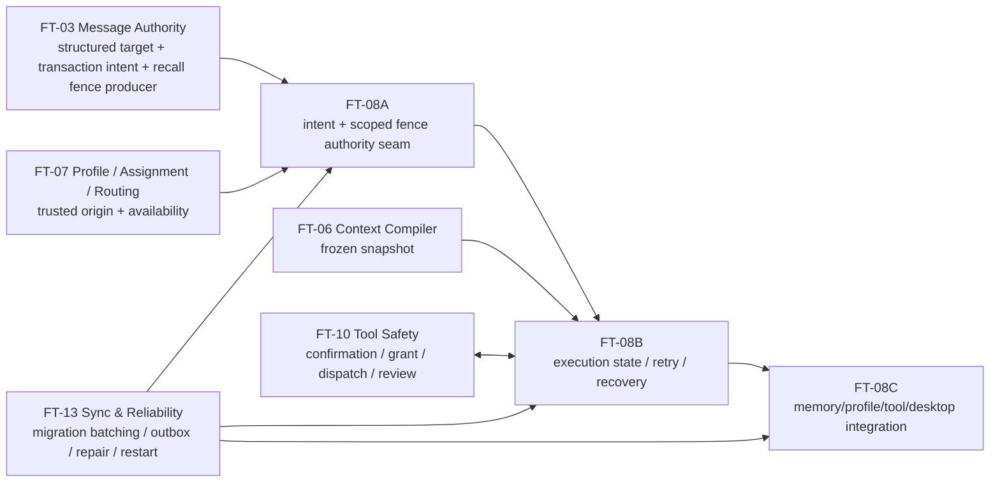

# FT-08 Invocation Runtime：生产工程设计与 FT-03 scoped authority seam

> 日期：2026-08-18
>
> 性质：生产工程设计；只冻结后续实现合同，不修改代码、Blueprint、任务状态或既有验收结论。
>
> 产品权威：[当前批准 PRD](../reconstruction/2026-08-agent群聊协作模式-prd.reconstructed.md)；证据分级：[evidence map](../reconstruction/agent-im-evidence-map.md)；UI / 交互权威：[设计基线](../design/README.md)与[逐项覆盖矩阵](../design/design-requirement-coverage.md)。
>
> 上游消息合同：[FT-03 设计](./2026-08-18-ft03-message-authority-design.md)与[实施计划](./2026-08-18-ft03-message-authority-implementation-plan.md)；路线总图：[approved PRD implementation map](./2026-08-18-approved-prd-implementation-map.md)。

## 1. 结论、范围与验收边界

FT-08 应把现有“调用即创建 execution”的耦合拆成两个权威层：消息/路由事务先持久化不可丢失的 `AgentInvocationIntent`，异步 runtime 再为它创建一个或多个有 lineage 的 `AgentExecution`。用户可见状态只有 `accepted / running / completed / failed / cancelled`；`queued`、`retrying`、`waiting_confirmation` 是内部 phase 或动作，preview 永远不是权威事实。

本设计重点冻结 FT-03 可直接依赖的两个 seam：

1. **durable handoff seam**：每个结构化 Agent target 独立持久化 intent 或稳定 rejected outcome；Human 消息 ACK 不等待 execution。
2. **scoped cancellation seam**：关联 reply/correction、显式 cancel、source recall 或明确 supersede 只对关联 intent/execution 建 fence；AuthorityWorker 先提交 terminal CAS，再传播 `AbortSignal` 并清 preview。

直接覆盖的 FT-08 Requirement 为 `REQ-AGT-001/002/004/006/008/009/010/012`、`REQ-MEM-008/010`、`REQ-MSG-001/008`、`REQ-NFR-005`、`REQ-PRIM-011/012/013`。横切安全边界还必须遵守 `REQ-MSG-005/006`、`REQ-ROOM-004`、`REQ-AGT-013`、`REQ-NFR-004/011/014`。

本文件只证明设计达到实施准备条件，不证明 FT-08 已实现，也不把旧 T-0020 的新合同标为 verified。

## 2. 设计基线映射

| 项 | 本设计映射 |
| --- | --- |
| 产品旅程 | `J-03` 结构化 `@Agent` → accepted/running/终态；`J-05` confirmation/grant/dispatch/outcome_unknown；`J-07` offline/sync/repair、archive/revoke。 |
| 组件/状态 | execution card、双 Agent 独立卡、非权威 preview、waiting confirmation、failed/retry、cancelled/superseded、outcome_unknown review。 |
| 权威来源 | composer 与 preview 为 local transient；message/target receipt 与 control command 为 ACK；intent/execution/confirmation/tool lifecycle 为 stable event；availability、source-revised、repair view 为 projection。 |
| loading / empty | command submitting 有 requestId；无 execution 时 target receipt 仍显示“intent 已登记”；无 pending work 是正常 empty，不伪造 ready execution。 |
| 错误 | `401` 重新认证；`403` 权限/成员/assignment 已失效；`409` CAS、stale attempt、terminal 或 duplicate；`410` source/snapshot/confirmation 已失效；`429` 有界队列并给 retryAfter；`503` noauth/provider/storage/recovery unavailable；offline 禁止写；repair failed 保留旧完整 cache。 |
| 可访问性 | 所有状态有文字与图形而非只靠颜色；control 提交后焦点留在原卡并通告结果；错误焦点移到可恢复动作；preview `aria-live=off`；终态用克制的 status 通告；键盘可触达 cancel/retry/review；200% zoom、最小 840px 窗口、reduced motion 下无依赖动画。 |
| 偏离 | 无。设计稿中的步进按钮和 fixture 仍是 prototype-only；没有 ACK/event/projection 时不得显示生效。 |

## 3. 当前实现事实与处置

当前基线是 schema v12；v12 只在 v11 上追加 session families，runtime 主体仍来自 v6、route 来自 v7、hard human preemption 来自 v11。

| 当前机制 | 证据与判断 | FT-08 处置 |
| --- | --- | --- |
| T-0041 execution/attempt 五态、expected-attempt CAS、commit-before-abort、partial 隔离 | `agent-runtime/`、v6 tables 与真实 worker tests 已证明机制可行。 | **复用**五态、attempt CAS、bounded scheduler、Provider/tool deep seams；按新 intent/snapshot/fence 扩展。 |
| T-0041 confirmation + grant claim + append-only dispatch / `outcome_unknown` | 当前 `consumed_at` 能证明一次消费，但缺完整 rejected/revoked/expired 状态。 | **复用事务形状**；状态机与 archive/revoke/recall seam 由 FT-08/10 协调扩展，不能把 cancel 说成撤销已 dispatch side effect。 |
| T-0016 一消息一 RouteJob、closed judgments、route attempt/recovery | 可作为可信 server-generated routed provenance。 | **复用 RouteJob/judgment authority**；route completion 必须原子 durable handoff，不能先 terminal 再 best-effort invoke。 |
| `agent_invocation_intents UNIQUE(source_message_id,target_agent_id)` | 同 source/target 永久合并；intent 直接拥有唯一 execution。 | **替换**为 turn-aware intent 与一对多 execution lineage；历史唯一约束只作迁移输入。 |
| public `agent.invoke` 接收 `direct_mention/structured_help/routed_candidate` | 客户端可自报 server-only kind。 | **删除 public kind 选择**。显式调用来自 FT-03 structured target；route/proactive 只由内部 capability 创建。兼容 endpoint 若短期存在，只接受 direct request reference，且不得接收 Agent identity/capability/kind。 |
| T-0020 任意 Human message → room-wide fence → reroute/replacement | 当前 production `message.send` ACK 路径调用 `HumanPreemptionRuntime.handle()`。 | **删除产品语义并封存 durable 历史只读**；不得由无关新消息取消/重排 Room work，不再产生 broad replacement。 |
| T-0020 cancel candidate matrix | queued、waiting、tool-not-started 可先 CAS 后 abort；late attempt 由 CAS 隔离。 | **复用并发手法**，但候选集合改为关联 intent/execution，不扫同 Room 全体。 |
| runtime timeout | timeout abort 后 catch 见 `signal.aborted` 可直接 return，留下 running 直到 restart。 | **修复**为先写 transient retry/terminal；用户 cancel 与 timeout 用不同 abort cause。 |
| recovery | 扫全部 queued/running；running 重建 attempt；side effect 保守 unknown。 | **扩展**为分页/游标式 drain-until-empty，先读 fence/terminal/snapshot；不能因单批上限遗留尾部。 |
| context | 最近 64 条、on-mention 工具为空、恢复时 intent 重构为 direct。 | **替换**为 FT-06 frozen snapshot + FT-07 envelope；恢复从 durable intent/provenance 读取。 |
| repair | 只有 execution/route；无 intent、attempt、confirmation/grant/dispatch。 | **扩展**为全部用户可见投影；preview 永不加入。 |

历史 `human_preemption_fences`、`agent_human_fences`、`agent_fence_replacements` 和 `room.human_preemption.applied` 不物理删除、不重新解释。迁移后它们只作为 `legacy_room_wide_preemption` audit/compatibility 记录读取；新 command、worker scan、event producer 与 replacement 创建路径必须关闭。

## 4. 权威聚合与不变量

### 4.1 聚合关系

```text
message transaction / route decision / project boundary
  └─ AgentInvocationIntent (durable, one target, one semantic turn)
       ├─ frozen source revision + trigger provenance
       ├─ shared room-facts snapshot reference
       ├─ per-Agent envelope snapshot reference
       └─ AgentExecution 1..N
            ├─ AgentExecutionAttempt 1..N (crash/transient retry)
            ├─ confirmation / grant / dispatch 0..N
            └─ committed final 0..1
```

不变量：

- 一个 message target 在 FT-03 transaction 中恰有一个 target outcome；成功 outcome 引用一个 durable intent，失败 outcome 没有可 claim intent。
- intent 不等于 execution，intent accepted 不承诺 provider 已开始或必有 final。
- 每个 execution 恰有一个终态；terminal 不复活。
- 一个 execution 的所有 attempts 使用同一 frozen input snapshot；attemptSeq 单调且 stale result 不能覆盖 current attempt。
- Human retry 创建新 execution，不更改旧 terminal；纠正/新上下文创建新 intent/turn，不伪装成 crash retry。
- 每个 target 的 intent、execution、failure、cancel、final 独立；一个 target 的故障或撤权不连带另一个 target。

### 4.2 `AgentInvocationIntent`

建议 closed contract（最终字段名可在实现 ADR 中做机械对齐，但语义不得改变）：

```ts
type InvocationOrigin =
  | { kind: "message_target"; messageTransactionId: string; targetId: string }
  | { kind: "route_decision"; routeJobId: string; judgmentId: string }
  | { kind: "project_boundary"; boundaryId: string; boundaryKind: "checkpoint" | "due" | "blocker" };

interface AgentInvocationIntent {
  intentId: string;
  lineageId: string;
  turnId: string;
  roomId: string;
  sourceMessageId: string;
  sourceRevision: number;
  targetId: string;
  agentId: string;
  origin: InvocationOrigin;       // server-derived only
  status: "pending" | "claimed" | "cancelled";
  createdAt: string;
  claimedAt?: string;
  cancelledAt?: string;
  cancellationReason?: InvocationCancellationReason;
  supersedesIntentId?: string;
}
```

`targetId` 是本轮结构化 target/handoff 的稳定 ID，`agentId` 是被解析出的稳定 Actor ID；两者都由 authority 从 FT-03 message structure 或可信内部 producer 得到。displayName、正文 regex、客户端提供的 actor/capability/route kind 都不参与身份决定。

唯一性替换为：

- `intent_id` 主键；
- FT-03 初始 handoff：`UNIQUE(message_transaction_id, target_id)`，确保同一 target outcome exactly once；
- 语义轮次：`UNIQUE(lineage_id, turn_id, agent_id)`；
- origin 自己的稳定 producer key 唯一，例如 `(route_job_id, judgment_id)` 或 `boundary_id`；
- **禁止**永久 `UNIQUE(source_message_id, agent_id)`。

同一 source/target 可出现多轮：初始 direct turn、明确 correction/supersede turn、以及 eligible Human retry 的新 execution。每轮通过 `lineageId + turnId` 可追踪；Human retry 仍挂在同一个 intent/turn 下，通过 execution lineage 区分，不创建第二个 target outcome。

### 4.3 public 与 internal command boundary

- public Human 能提交的是 FT-03 `message.send.v2` 中的 structured Agent target，以及 `invocation.cancel { intentId|executionId, expectedVersion }`、`invocation.retry { executionId }` 等对象控制命令。
- public payload 不含 `agentId` 自选、`targetAgentId` 自选、author、capability、provider/model、origin、route kind、proactive kind、room role、tool grants 或 internal snapshot ID。
- `message_target` 的 `agentId` 由 message transaction 根据 `targetId`/structured entity 解析并冻结。
- `route_decision` 只接受 AuthorityWorker 内部 capability，且必须引用 terminal RouteJob + `will_respond` judgment。
- `project_boundary` 只接受 FT-09 内部 producer，且必须引用未消费、仍有效的 confirmed boundary；不得从 Agent final 自动级联。
- 普通 Agent final 永不成为 autonomous Agent-to-Agent delegation trigger。

### 4.4 execution 与 attempt

`AgentExecution.status` 改用产品五态：`accepted | running | completed | failed | cancelled`。数据库可在兼容投影中把旧 `queued → accepted`；不得增加第六个用户态。

内部 `phase` 为 closed union，例如：

```text
accepted: queued | retry_scheduled | recovery_queued
running: claiming | snapshot_frozen | model_generation | read_tool | waiting_confirmation |
         side_effect_claimed | final_committing
terminal: completed | failed | cancelled
```

`retrying` 是“同 execution 新 attempt 已安排”的动作；`waiting_confirmation` 是 running 子态；`selected/will_respond` 是 route/acceptance 链事实，不是 execution completed 保证。

execution 至少保存 `executionId, intentId, lineageId, executionOrdinal, retryOfExecutionId?, roomId, agentId, snapshotId, status, phase, currentAttemptSeq, terminalReason/version`。Human retry 唯一键使用原 control command 的 idempotency key，并以 `retryOfExecutionId` 保证只创建一个新 execution；不能再用“查到任意 manual retry child 即 replay”吞掉后续具名重试轮次。

### 4.5 frozen snapshot

Intent 创建时冻结 `sourceRevision`。execution claim 前由 FT-06 生成：

- 一个可由同 message transaction 多 target 共享的 `roomFactsSnapshotId/version/watermark`；
- 每个 Agent 独立的 `agentEnvelopeSnapshotId`，含稳定 agentId、Profile revision、Assignment revision、participation、职责、Provider/model disclosure 与工具 manifest；
- memory snapshot/version、project facts version、source/attachment manifest、context hash、token budget与 compiler version。

snapshot 是 immutable authority record。source 后续 revise 只在 projection 上增加 `sourceRevised=true/currentRevision`，不改变运行输入；source recall 令旧 snapshot operationally ineligible，并触发 scoped fence。Human retry 只有在 source 未 recall、Context 未 disputed、membership/Room/assignment 仍有效时才可默认复用旧 snapshot；带纠正或新上下文的操作必须创建新 intent + 新 snapshot。

crash/transient retry 留在原 execution，增加 bounded attempt，使用相同 `snapshotId`、Agent、Provider、model。不得在 recovery 时重新读取“最新 64 条”或把 provenance 重构为 direct。

## 5. scoped cancellation authority seam

### 5.1 合法触发与关联证明

只有以下 authority 已能证明关联的动作可建 fence：

1. structured reply/correction 明确引用 `intentId` 或 `executionId` 并声明 `supersede`；普通 reply 默认不取消；
2. authenticated Human 对有权控制的 intent/execution 发显式 cancel；
3. FT-03 source recall；
4. 新 intent 的 `supersedesIntentId` 经 same-room、same-lineage、权限与 source relation 校验；
5. 治理安全动作：archive、membership/assignment revoke、capability reduction（使用各自 reason，不伪装 Human 对话抢占）。

无关联 Human 新消息、Agent message、history/sync replay、preview、route diagnostic、displayName 命中都不能触发 cancellation。旧“扫 Room 全部 work 并 reroute”的入口必须移除。

### 5.2 单 writer 事务

`commitScopedCancellation(scope, expectedVersion, reason)` 在 AuthorityWorker 的一个 transaction 中：

1. 重新验证 controller principal/internal capability、Room、source relation、intent/execution current version；
2. 插入 immutable fence（稳定 producer key，replay 返回同 receipt）；
3. pending intent CAS → `cancelled(reason)`；
4. accepted/running execution CAS → `cancelled(reason)`，current attempt 同步 terminal；terminal execution保持原值并在 receipt 中标 `already_terminal`；
5. pending confirmation → `rejected(reason)`；confirmed confirmation 保持不可变；
6. 未 claim grant → `revoked(reason)`；已 claimed grant/dispatch 不回滚；
7. 写 stable execution/confirmation/grant events、outbox、idempotency receipt；
8. COMMIT。

commit 后 runtime 才根据 receipt：从 queue 移除、abort current controller、清除该 execution 的本地 preview buffer，并发送非耐久 `preview.reset`。任何这些 post-commit 动作失败都不能复活 execution；restart scan 从 fence/terminal 收敛。

final commit 必须用 `executionId + attemptSeq + executionVersion + status=running + no cancel fence + snapshot eligible` 的 CAS，在同一事务写 Agent final、execution completed、event/outbox。迟到 provider final、checkpoint、tool prepare 或下一轮 model call全部因 terminal/fence/stale attempt 零写。

### 5.3 recall/final 决定性竞态

| AuthorityWorker 提交顺序 | 最终事实 |
| --- | --- |
| final transaction 先 commit | final 与 completed execution 保留；随后 recall 只 tombstone source、标记 source recalled，不回滚 final 或 confirmed project fact。 |
| recall/fence transaction 先 commit | intent/execution cancelled；late final CAS 失败；Agent message/event/outbox/memory candidate **零写**。 |
| 两者都尚未 commit | `BEGIN IMMEDIATE` 串行化，按实际 winner 使用上两行，不允许 UI 时钟猜测。 |

partial preview 在两种顺序中都不是消息；cancel/recall、disconnect、crash、membership revoke 或 attempt rollover 都必须清除。

## 6. retry、recovery 与 boundedness

### 6.1 自动 retry

- 只有 closed transient error 可重试；默认继承 T-0041 的至多 3 attempts 与有界 backoff，具体数值在容量/可靠性评审时与 FT-13 冻结。
- timeout 必须先用 current attempt CAS 写 retry-scheduled 或 failed，再 abort/return；不能因 `signal.aborted` 直接留下 running。
- side effect dispatch 后的 timeout/异常不进入普通 retry，转 `outcome_unknown`/review。
- terminal、fenced、source recalled、snapshot ineligible、membership/assignment revoked、Room archived 的 execution不进入 retry。
- attempt result/checkpoint带 attemptSeq；旧 attempt 永远不能更新新 attempt、final、confirmation或dispatch。

### 6.2 Human retry

Human 对 eligible `failed/cancelled` 执行 retry，AuthorityWorker 新建 execution，写 `retryOfExecutionId`、同 lineage 与单调 `executionOrdinal`。它不复活旧 terminal，不消耗旧 execution 的 attempt 预算。`outcome_unknown`、`cannot_undo/needs_review` 在 review 闭合前没有 generic retry；新动作必须生成新 toolCall。

### 6.3 restart scan

恢复必须按稳定 keyset cursor/claim lease 分页，循环直到某次扫描返回空，而不是固定“最多 N 批后抛错并永久遗留”。每条 candidate 在 claim transaction 重新读取：fence、terminal、current attempt、nextRetryAt、Room lifecycle、membership、Profile/Assignment/availability、snapshot eligibility、confirmation/grant/dispatch。

为避免坏记录阻塞尾部，单项 closed failure写 terminal/dead-letter 或 `needs_review` 后推进 cursor；数据库/worker 全局不可用才停止并由 FT-13 health/重启机制重试。队列满时不丢 durable candidate，记录 backpressure 并在 drain 后继续 scan。shutdown 必须停止新 claim、等待/终止有界 controller并完成最后一次 terminal/lease 处理；HumanPreemptionRuntime 的无 `close()` tail 不再承担新语义。

## 7. 每个执行点的重验矩阵

| 执行点 | 必须重验 | 失败收敛 |
| --- | --- | --- |
| intent transaction | source/current revision、target kind、current Room membership/Agent Assignment、Room active、origin capability。 | per-target rejected outcome；不回滚合法 Human message/其他 target。 |
| execution create/claim | intent pending/claimed、无 fence、Profile active、Assignment active、participation允许该 origin、availability ready/not reserved、Room active。 | visible rejected/failed/cancelled；不调用 Provider。 |
| snapshot build/read | source revision、recall/dispute、memory version/health、Room ACL、Agent envelope revisions。 | explicit context/snapshot error；risk proactive 在 memory degraded 时暂停。 |
| model invoke与每轮 continuation | execution/attempt current、无 fence、Room/membership/assignment/Profile、availability reservation、snapshot仍 operationally eligible。 | terminal或retry；不自动换 Agent/模型。 |
| preview publish | execution/attempt current、subscriber session与Room membership、当前订阅 generation、bounded backpressure。 | 丢弃/清除 preview；不改变 execution。 |
| read tool prepare/claim | global capability ∩ Assignment grant ∩ current membership、closed tool、snapshot/source权限、Room active。 | adapter call count 0；closed permission failure。 |
| confirmation/side-effect claim | 上述全部 + exact params hash、principal/session binding、expiry、confirmation/grant active、parent current。 | reject/revoke；adapter call count 0。 |
| final commit | current attempt/version、无 fence、Room/membership/Assignment仍有效、snapshot合法、无 unresolved side-effect review。 | late final零写或显式 failed/cancelled。 |
| retry/recovery | terminal/fence/source/snapshot/Room/Profile/Assignment/availability/tool state。 | 不复活；需要 Human review时停住。 |

availability 的 `busy` 必须由 durable reservation/running execution投影；当前 execution 自己的 reservation不能在后续检查中把自己拒绝。`paused/noauth` 不启动新 execution；运行中因安全撤权按 scoped governance reason取消，已 dispatch副作用进入证据保留分支。

## 8. confirmation、grant、dispatch 与 race 边界

FT-08 拥有 parent execution/fence/abort；FT-10 拥有 closed tools、confirmation principal、grant/dispatch/review状态机。两者通过同一 AuthorityWorker transaction API 合并，不允许跨 writer 的“先 cancel，稍后 revoke”。

| race 时点 | 必须结果 |
| --- | --- |
| pending confirmation vs cancel/recall/archive/revoke | confirmation → `rejected(stable_reason)`；未 claim grant → revoked；parent cancelled；adapter 0 次。 |
| confirmed、grant 尚未 claim | confirmation保持 confirmed；grant原子 revoked；parent cancelled；晚到 claim 409/410，adapter 0 次。 |
| durable dispatch claim 已提交 | dispatch事实保留；cancel只停止后续 model/tool steps；已知 success/failure继续记录，异常为 outcome_unknown；不得显示“已撤销副作用”。 |
| archive | 新 intent/claim禁止；pending/revocable按上两行收敛；安全 expiry继续流逝；已 dispatch 保留review。 |
| membership/assignment/capability revoke | 在下一个执行点 fail closed；claim前零调用，claim后保留 known/unknown outcome；不因重新加入自动复活。 |
| source recall | 与 cancel相同，但 completed final/confirmed fact不回滚，snapshot此后不可用于Human retry。 |

`outcome_unknown` 不自动 replay、不提供 generic retry；Human review把原 toolCall闭合为 known succeeded/known failed/compensated/accepted risk。若仍需行动，创建新 invocation/execution/toolCall。

## 9. persistence、event、sync/repair 合同

不预占 schema 版本号。FT-02A 正在修改共享治理/schema 面，FT-13 正在设计可靠性；合入时必须从届时 `AUTHORITY_SCHEMA_VERSION` 追加一个或多个 immutable migration，历史 v1-v12 statement/checksum/fingerprint逐字不改。

逻辑新增/重建表：

- `agent_invocation_intents`：turn-aware immutable identity、origin、source revision、targetId、status；移除旧永久 source/target unique。
- `agent_execution_lineage` 或 execution 新列：intentId、lineageId、executionOrdinal、retryOf、snapshotId、version/phase。
- `invocation_snapshots` + per-Agent envelope manifest（或 FT-06 等价表）。
- `invocation_cancel_fences` + scoped targets/receipt。
- FT-10 协调的 confirmation/grant state/reason/version；dispatch保持append-only。

stable events 至少投影 intent accepted/cancelled、execution five-state/phase摘要、confirmation/grant/dispatch/outcome review。事件不含 raw prompt、preview、tool正文、secret或hidden reasoning。

repair fixed-watermark 必须能重建：intent/target outcome、execution+lineage+current attempt summary、source revised/recalled marker、pending confirmation、confirmed/revoked grant、dispatch/outcome_unknown/review。history/events/repair 共用 canonical projection。preview 不进 messages、events、outbox、history、repair、memory、search、diagnostic或持久 client cache。

## 10. 依赖 DAG 与集成所有权



- FT-03 owns message structure、target outcome、source revision/recall transaction；FT-08 owns claim/execution/fence consumption/final CAS。
- FT-06 owns snapshot compiler/content manifest；FT-08 owns snapshot binding、eligibility与attempt不漂移。
- FT-07 owns Global Profile、Room Assignment、participation、availability与 route producer；FT-08只消费并在执行点重验。
- FT-10 owns tool safety facts；FT-08 owns parent cancellation与“claim后不伪装回滚”。共享 CAS 必须同 migration/AuthorityWorker batch 合入。
- FT-13 owns通用 outbox/backoff/dead-letter、fixed-watermark repair、restart orchestration与 migration batching；FT-08 owns feature record/invariant/recovery semantics。

## 11. 明确禁止与 fail-closed 清单

- 禁止 client-supplied Agent identity、capability、route/proactive/structured kind、provider/model。
- 禁止任意 Human 新消息取消 Room 全部 work。
- 禁止 preview 进入任何 durable message/event/history/repair/memory路径。
- 禁止 `silent` participation、silent execution或永久 spinner。
- 禁止自动换 Agent、换模型、换 Provider或静默 fallback。
- 禁止任意 shell、URL、binary、argv、cwd或文件系统范围；仅沿用经 FT-10 批准的闭集。
- 禁止普通 Agent final触发 autonomous Agent-to-Agent delegation。
- 禁止把 cancel、recall、archive说成撤销已 dispatch/已完成的外部副作用或 confirmed project fact。

## 12. 实施准备退出条件

进入编码前需由 FT-03/06/07/10/13 owner 共同确认：字段命名与 writer ownership、migration合并顺序、snapshot接口、confirmation/grant CAS、repair record union。只要这些 seam 按本文冻结，FT-08A 可以先实现且不等待完整 Desktop/memory UI。

设计评审通过只表示 **FT-08 达到实施准备条件**。它不表示 FT-08 已交付，也不表示旧 T-0020 已按新 scoped 产品合同 verified。
